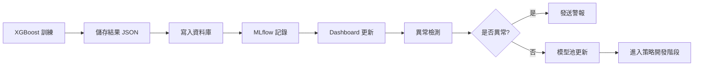

# XGBoost 多結果分析指南

> **版本**: 1.1  
> **建立日期**: 2026-01-20  
> **最後更新**: 2026-01-20  
> **適用於**: 量化交易系統 - 樣式發現與評估

---

> 🧠 **Claude Opus 總體評價**: 這份文件架構完整、涵蓋面廣，已經整合了多個 AI 的建議。以下是我認為可以進一步強化的幾個關鍵面向：
> 
> 1. **樣本外時間驗證 (Out-of-Time Validation)**: 建議增加「完全未見過的時間區間」作為最終驗證，而非僅依賴 CV
> 2. **訊號衰減週期分析**: 量化策略的 alpha 會隨時間衰減，需要追蹤模型有效期
> 3. **多幣種/多時間框架的泛化性**: 在 BTCUSDT 訓練的模型，能否在 ETHUSDT 上有效？

---

## 📋 目錄

1. [分析框架概述](#分析框架概述)
2. [核心評估維度](#核心評估維度)
3. [視覺化呈現方式](#視覺化呈現方式)
4. [Dashboard 設計建議](#dashboard-設計建議)
5. [業界工具與實踐](#業界工具與實踐)
6. [分析流程範例](#分析流程範例)
7. [實作建議](#實作建議)

---

## 🎯 分析框架概述

### 分析目標

對於多個 XGBoost 訓練結果，我們需要回答以下關鍵問題：

1. **模型品質**: 哪些模型表現最好？
2. **穩定性**: 哪些模型最穩定可靠？
3. **特徵重要性**: 哪些特徵最具預測力？
4. **過擬合風險**: 哪些模型有過擬合問題？
5. **業務價值**: 哪些模型最符合交易策略需求？


### 分析層次

```
層次 1: 個別模型評估
  ├─ 訓練/驗證表現
  ├─ 特徵重要性
  └─ 混淆矩陣

層次 2: 模型間比較
  ├─ 性能排名
  ├─ 穩定性比較
  └─ 特徵一致性

層次 3: 組合策略
  ├─ 集成學習
  ├─ 模型選擇策略
  └─ 風險分散
```

> 🤖 **GPT-5.2 建議**: 這份文件的結構與覆蓋面已經很完整；若要讓「多結果比較」更接近可上線決策，建議再補強 5 個面向：
> 1. **時間序列切分與洩漏防護**：使用 walk-forward / purged CV，避免標籤窗口重疊造成資訊洩漏。
> 2. **統計顯著性與不確定性**：針對 CV 結果提供信賴區間、配對檢定或 bootstrap，避免用單次平均值做決策。
> 3. **機率校準**：除了 calibration curve，增加 Brier score / ECE，讓跨版本比較更可信。
> 4. **可重現性**：每個結果應包含資料快照、特徵清單 hash、版本資訊與隨機種子，才可追溯比較。

---

## 📊 核心評估維度

### 1. 性能指標矩陣

> 🤖 **Gemini 建議**: 除了傳統 ML 指標，必須引入「準交易指標」。高 AUC 不代表高獲利，有時模型過度優化容易預測的「噪音」而非真正的「趨勢」。

| 指標類別 | 核心指標 | 計算方式 | 理想值 | 應用場景 |
|---------|---------|---------|--------|---------|
| **分類性能** | Train AUC | ROC曲線下面積 | >0.70 | 訓練集表現 |
| | CV AUC Mean | 交叉驗證平均AUC | >0.65 | 泛化能力 |
| | CV AUC Std | 交叉驗證標準差 | <0.05 | 穩定性 |
| | **(新增) PR AUC** | Precision-Recall 曲線下面積 | 越高越好 | 類別不平衡時更可靠 |
| | **(新增) Precision@K** | 前 K% 高分樣本的 Precision | 越高越好 | 只交易最有把握的訊號 |
| **業務指標** | 盈利樣本比例 | profitable_count / sample_count | >0.55 | 實際交易價值 |
| | 樣本規模 | sample_count | >1000 | 統計顯著性 |
| | **(新增) 期望值** | Win% * AvgWin - Loss% * AvgLoss | >0 | 策略預估 |
| | **(新增) 方向準確率** | Directional Accuracy | >55% | 趨勢判斷 |
| **過擬合檢測** | AUC Gap | Train AUC - CV AUC Mean | <0.10 | 泛化差距 |
| | CV Stability | 1 / CV AUC Std | >20 | 穩定性倒數 |
| **(新增) 分佈穩定性** | **PSI (特徵飄移)** | Population Stability Index | <0.1 | 模型壽命 |
| **(新增) 校準** | **Brier Score** | mean((p-y)^2) | 越低越好 | 機率是否可信 |
| | **ECE** | Expected Calibration Error | 越低越好 | 校準誤差摘要 |

> 🧠 **Claude Opus 建議**: 建議額外增加泛化能力指標：
> 
> | 指標類別 | 核心指標 | 計算方式 | 理想值 | 應用場景 |
> |---------|---------|---------|--------|---------|
> | **泛化能力** | OOT AUC | Out-of-Time 驗證 AUC | >0.60 | 真實泛化 |
> | | Cross-Symbol AUC | 跨幣種驗證 AUC | >0.55 | 模型普適性 |

> 🤖 **GPT-5.2 建議**: 多模型比較時，建議把指標分成「篩選用」與「決策用」。
> - **篩選用**：CV AUC/PR AUC、AUC Gap、CV Std、PSI（先排除洩漏/不穩定）。
> - **決策用**：Precision@K（最後排序與選模）。

### 2. 特徵重要性分析

**維度**:
- **Gain**: 特徵帶來的平均性能提升 (預測力最強)
- **Cover**: 特徵覆蓋的樣本比例 (影響範圍最廣)
- **Frequency**: 特徵被使用的次數 (最常被用到)

> 🤖 **Gemini 建議**: 不要只看全域重要性 (Global Importance)。
> 1. **方向性影響**: 使用 SHAP value 判斷特徵是「正相關」還是「負相關」。例如 `RSI > 80` 對某些幣種是做多訊號，對其他是做空訊號。
> 2. **交互作用**: XGBoost 強在捕捉特徵交互，檢查 top 特徵是否總是成對出現。

> 🤖 **GPT-5.2 建議**: 重要性最好做「交叉驗證層級的穩定性」而不是只看單一模型：
> - **Fold-level Importance**：每個 fold 都輸出 Gain/SHAP，再計算均值與變異。
> - **Permutation Importance (out-of-sample)**：用置換重要性驗證特徵是否真的貢獻泛化能力。
> - **SHAP Interaction Values**：針對 Top-N 特徵對，找出穩定交互（避免只靠單一指標的偶然共振）。

**分析重點**:
```python
# 跨模型特徵一致性
common_top_features = set()
for model in models:
    top_10 = model.get_top_features(n=10)
    common_top_features.update(top_10)

consistency_score = len(common_top_features) / (len(models) * 10)
# consistency_score > 0.5 表示特徵選擇一致
```

### 3. 時間穩定性與市場體制 (Regime)

> 🤖 **Gemini 建議**: 市場有牛熊之分。模型在 2021 (牛市) 的高 AUC 可能是因為它只會喊多。

```
市場體制過濾 (Regime Filtering):
  ├─ 牛市表現 (Bull Market AUC)
  ├─ 熊市表現 (Bear Market AUC)
  └─ 震盪市表現 (Sideways AUC)
  
重點檢查: 是否有模型在特定體制下表現極差 (Drawdown Risk)？
```

> 🧠 **Claude Opus 建議**: 市場體制分析是量化交易的關鍵，建議增加：
> 
> **體制識別方法**:
> ```python
> def identify_regime(df: pd.DataFrame, lookback: int = 20) -> pd.Series:
>     """
>     基於 ADX + 趨勢方向 識別市場體制
>     """
>     # 趨勢強度
>     adx = ta.adx(df['high'], df['low'], df['close'], length=lookback)['ADX_20']
>     
>     # 趨勢方向 (SMA 斜率)
>     sma = df['close'].rolling(lookback).mean()
>     trend_direction = sma.diff(5) / sma.shift(5)
>     
>     regime = pd.Series('sideways', index=df.index)
>     regime[(adx > 25) & (trend_direction > 0.02)] = 'bull'
>     regime[(adx > 25) & (trend_direction < -0.02)] = 'bear'
>     
>     return regime
> ```
> 
> **體制感知的模型評估**:
> - 計算每個體制下的 Win Rate 和 Expectancy
> - 標記「體制偏好型」模型（如：只在牛市有效）
> - 建議：組合不同體制偏好的模型以平滑收益曲線

> 🤖 **GPT-5.2 建議**: 若你的標籤/報酬窗口會跨時間（例如未來 N 根 K 線），請優先採用以下切分方式避免洩漏：
> - **Walk-forward validation**：按時間滾動訓練/驗證，貼近實際上線流程。
> - **Purged K-Fold / Embargo**：驗證集與訓練集之間留出 embargo 區間，避免重疊樣本共享未來資訊。
> - **Regime-aware 評估**：把 bull/bear/sideways 的分群規則固定化（例如用趨勢/波動度指標）以利跨版本對照。

---

## 📈 視覺化呈現方式

### 1. 性能比較圖表

> 🤖 **GPT-5.2 建議**: 除了 ROC/AUC，建議加入「更貼近交易行為」的兩種圖：
> - **PR 曲線**：類別不平衡時比 ROC 更敏感。
> - **Lift / Cumulative Gain**：回答「只交易最有把握的前 10% 訊號，命中率提升多少？」

#### A. 散點矩陣圖 (Performance Scatter Matrix)
```python
import plotly.graph_objects as go
from plotly.subplots import make_subplots

# X軸: Train AUC, Y軸: CV AUC, 顏色: AUC Gap, 大小: 樣本數
fig = go.Figure(data=[go.Scatter(
    x=train_aucs,
    y=cv_aucs,
    mode='markers',
    marker=dict(
        size=sample_counts / 100,  # 標準化大小
        color=auc_gaps,
        colorscale='RdYlGn_r',  # 紅(大差距) -> 綠(小差距)
        showscale=True,
        colorbar=dict(title="AUC Gap")
    ),
    text=model_names,
    hovertemplate='<b>%{text}</b><br>' +
                  'Train AUC: %{x:.3f}<br>' +
                  'CV AUC: %{y:.3f}<br>' +
                  'Samples: %{marker.size}k<br>' +
                  '<extra></extra>'
)])

fig.add_shape(  # 理想區域框
    type="rect", x0=0.7, x1=1.0, y0=0.65, y1=1.0,
    line=dict(color="green", dash="dash")
)
```

**解讀**:
- 右上角 = 高性能模型
- 接近對角線 = 低過擬合
- 大泡泡 = 樣本充足

#### B. 雷達圖 (Radar Chart) - 多維評分
```python
categories = ['Train AUC', 'CV AUC', '穩定性', '樣本數', '盈利比例']
fig = go.Figure()

for model in top_5_models:
    fig.add_trace(go.Scatterpolar(
        r=[
            model.train_auc,
            model.cv_auc_mean,
            1 / (model.cv_auc_std + 0.001),  # 穩定性倒數
            min(model.sample_count / 5000, 1.0),  # 標準化
            model.profitable_count / model.sample_count
        ],
        theta=categories,
        fill='toself',
        name=model.name
    ))
```

**優勢**: 一眼看出模型優缺點

#### C. 熱力圖 (Heatmap) - 模型排名矩陣
```python
import seaborn as sns

# 行: 模型, 列: 評估指標
metrics_df = pd.DataFrame({
    'Train_AUC_Rank': ...,
    'CV_AUC_Rank': ...,
    'Stability_Rank': ...,
    'Sample_Rank': ...,
    'Profit_Rank': ...
})

sns.heatmap(metrics_df, annot=True, cmap='RdYlGn', 
            cbar_kws={'label': 'Rank (1=Best)'})
```

> 🤖 **GPT-5.2 建議**: 排名熱力圖請同時提供「權重版本」與「敏感度分析」：
> - 同一批模型用 3-5 組不同權重產生名次，觀察 Top-10 是否穩定。
> - 若名次對權重極敏感，代表模型差距不夠大或指標不夠對齊交易目標。

### 2. 特徵重要性視覺化

#### A. 堆疊條形圖 (Stacked Bar Chart)
```python
# 跨模型特徵重要性累積
feature_importance_matrix = []  # shape: (n_models, n_features)

fig = go.Figure(data=[
    go.Bar(name=feature, x=model_names, y=importances)
    for feature, importances in zip(features, importance_matrix.T)
])
fig.update_layout(barmode='stack')
```

#### B. 特徵穩定性氣泡圖
```python
# X: 平均重要性, Y: 重要性標準差, 大小: 出現頻率
fig = go.Figure(data=[go.Scatter(
    x=feature_mean_importance,
    y=feature_std_importance,
    mode='markers+text',
    marker=dict(size=feature_frequency * 20),
    text=feature_names,
    textposition='top center'
)])
```

**目標**: 找到「高重要性 + 低變異」的穩定特徵

> 🧠 **Claude Opus 建議**: 特徵穩定性分析可進一步增加「時間衰減」維度：
> 
> **特徵重要性時間衰減分析**:
> ```python
> def analyze_feature_decay(models_by_date: Dict[str, Any]) -> pd.DataFrame:
>     """
>     分析特徵重要性是否隨時間衰減
>     """
>     feature_importance_timeline = []
>     
>     for date, model in sorted(models_by_date.items()):
>         for feature, importance in model.feature_importance.items():
>             feature_importance_timeline.append({
>                 'date': date,
>                 'feature': feature,
>                 'importance': importance
>             })
>     
>     df = pd.DataFrame(feature_importance_timeline)
>     
>     # 計算每個特徵的重要性趨勢 (斜率)
>     decay_analysis = df.groupby('feature').apply(
>         lambda x: np.polyfit(range(len(x)), x['importance'], 1)[0]
>     ).rename('decay_slope')
>     
>     return decay_analysis.sort_values()
>     # 負斜率 = 重要性遞減（可能過時）
>     # 正斜率 = 重要性遞增（可能是新發現的 alpha）
> ```

### 3. 時間序列分析

#### A. 性能衰減曲線
```python
# 按訓練時間排序，觀察AUC趨勢
fig = make_subplots(specs=[[{"secondary_y": True}]])
fig.add_trace(go.Scatter(x=dates, y=train_aucs, name='Train AUC'))
fig.add_trace(go.Scatter(x=dates, y=cv_aucs, name='CV AUC'))
fig.add_trace(go.Bar(x=dates, y=sample_counts, name='樣本數'), 
              secondary_y=True)
```

#### B. 機率校準曲線 (Calibration Curve)

> 🤖 **Gemini 建議**: 檢查模型的「自信」是否真實。如果模型預測 0.9 的機率獲勝，實際上這類樣本是否真的有 90% 獲勝？

```python
from sklearn.calibration import calibration_curve

prob_true, prob_pred = calibration_curve(y_true, y_prob, n_bins=10)
fig = go.Figure()
fig.add_trace(go.Scatter(x=prob_pred, y=prob_true, mode='lines+markers', name='Model'))
fig.add_trace(go.Scatter(x=[0, 1], y=[0, 1], mode='lines', name='Perfectly Calibrated', line=dict(dash='dash')))
# 理想情況：曲線貼合對角線
# S型曲線：模型過度自信/缺乏自信
```

> 🤖 **GPT-5.2 建議**: 校準不只看曲線，請把 **Brier score / ECE** 列入儀表板摘要；並在輸出訊號時保留「未校準/已校準」兩版機率，避免校準錯誤把排序打亂。

---

## 🎛️ Dashboard 設計建議

### 推薦工具

| 工具 | 優勢 | 缺點 | 適用場景 |
|-----|------|------|---------|
| **Streamlit** | 快速開發、Python原生 | 性能有限 | 內部分析工具 |
| **Plotly Dash** | 互動性強、生產級 | 學習曲線 | 正式產品 |
| **Gradio** | UI美觀、易部署 | 客製化受限 | Demo展示 |
| **MLflow UI** | ML專用、版本追蹤 | 需配置伺服器 | 模型管理 |
| **Metabase** | SQL直連、BI功能 | 不支援複雜ML | 高層報告 |

### Dashboard 結構範例

#### **頁面 1: 模型概覽 (Model Overview)**
```
┌─────────────────────────────────────────────┐
│  📊 關鍵指標卡片                              │
│  ┌──────┐  ┌──────┐  ┌──────┐  ┌──────┐    │
│  │總模型│  │平均   │  │最佳   │  │異常   │    │
│  │ 25個 │  │AUC   │  │AUC   │  │模型   │    │
│  │      │  │0.682 │  │0.751 │  │ 3個  │    │
│  └──────┘  └──────┘  └──────┘  └──────┘    │
├─────────────────────────────────────────────┤
│  📈 性能分佈圖 (Scatter Plot)                │
│     [Train AUC vs CV AUC with filters]       │
├─────────────────────────────────────────────┤
│  🏆 Top 10 模型排行榜                         │
│     [Sortable table with key metrics]       │
└─────────────────────────────────────────────┘
```

#### **頁面 2: 特徵分析 (Feature Analysis)**
```
┌─────────────────────────────────────────────┐
│  🔍 特徵重要性排名                            │
│     [Cross-model feature importance]         │
├─────────────────────────────────────────────┤
│  🎯 特徵穩定性分析                            │
│     [Bubble chart: importance vs stability]  │
├─────────────────────────────────────────────┤
│  🔗 特徵相關性矩陣                            │
│     [Correlation heatmap of top features]    │
└─────────────────────────────────────────────┘
```

#### **頁面 3: 模型診斷 (Model Diagnostics)**
```
┌─────────────────────────────────────────────┐
│  ⚠️ 過擬合檢測                               │
│     [AUC Gap distribution + outliers]        │
├─────────────────────────────────────────────┤
│  📉 穩定性分析                               │
│     [CV Std vs Sample Count]                │
├─────────────────────────────────────────────┤
│  ⏱️ 時間衰減分析                             │
│     [Performance over time]                 │
└─────────────────────────────────────────────┘
```

#### **頁面 4: 業務價值 (Business Impact)**
```
┌─────────────────────────────────────────────┐
│  💰 盈利潛力評估                              │
│     [Profit ratio vs AUC scatter]            │
├─────────────────────────────────────────────┤
│  🎲 風險收益矩陣                              │
│     [Risk-adjusted return quadrant]          │
└─────────────────────────────────────────────┘
```

> 🧠 **Claude Opus 建議**: 針對模型分析，建議增加第 5 頁：
> 
> #### **頁面 5: 泛化性分析 (Generalization Analysis)**
> ```
> ┌─────────────────────────────────────────────┐
> │  ⏱️ 訊號時效性                               │
> │     [Signal validity decay over bars]       │
> ├─────────────────────────────────────────────┤
> │  🌐 跨幣種泛化性                             │
> │     [Cross-symbol performance heatmap]      │
> └─────────────────────────────────────────────┘
> ```
> 
> **關鍵元件**:
> - **訊號時效性**: 訊號發出後 1/3/5/10 根 K 線的命中率變化
> - **跨幣種矩陣**: 用 A 幣訓練的模型在 B/C/D 幣的表現，評估模型普適性

### 互動功能設計

```python
# Streamlit 範例
import streamlit as st

# 1. 側邊欄過濾器
with st.sidebar:
    min_auc = st.slider("最低 CV AUC", 0.5, 0.9, 0.6)
    max_gap = st.slider("最大 AUC Gap", 0.0, 0.3, 0.1)
    min_samples = st.number_input("最少樣本數", 100, 10000, 1000)

# 2. 動態篩選
filtered_models = df[
    (df['cv_auc_mean'] >= min_auc) &
    (df['auc_gap'] <= max_gap) &
    (df['sample_count'] >= min_samples)
]

# 3. 互動式圖表
selected_points = plotly_events(scatter_plot)  # 點擊散點
if selected_points:
    show_model_detail(selected_points[0]['pointIndex'])

# 4. 即時計算
if st.button("重新計算排名"):
    weights = {
        'cv_auc': st.slider("CV AUC 權重", 0.0, 1.0, 0.4),
        'stability': st.slider("穩定性權重", 0.0, 1.0, 0.3),
        'profit': st.slider("盈利比例權重", 0.0, 1.0, 0.3)
    }
    df['综合得分'] = calculate_composite_score(df, weights)
```

> 🤖 **GPT-5.2 建議**: Dashboard 最容易被忽略但最有價值的是「可追溯性與對照」：
> - **資料快照選擇器**：同一模型在不同資料版本/時間區間的結果可一鍵對照。
> - **特徵版本**：顯示特徵清單 hash（或 config 檔 checksum）與訓練程式碼版本（git commit）。

---

## 🛠️ 業界工具與實踐

### 1. MLflow - 模型生命週期管理

**功能**:
- 實驗追蹤 (Experiment Tracking)
- 模型版本管理 (Model Registry)
- 部署管道 (Deployment Pipeline)

**整合範例**:
```python
import mlflow
import mlflow.xgboost

# 記錄每次訓練
with mlflow.start_run(run_name=f"XGBoost_{symbol}_{timestamp}"):
    # 記錄參數
    mlflow.log_params({
        "max_depth": params['max_depth'],
        "learning_rate": params['learning_rate'],
        "n_estimators": params['n_estimators']
    })
    
    # 記錄指標
    mlflow.log_metrics({
        "train_auc": train_auc,
        "cv_auc_mean": cv_auc_mean,
        "cv_auc_std": cv_auc_std,
        "sample_count": sample_count
    })
    
    # 儲存模型
    mlflow.xgboost.log_model(model, "xgboost_model")
    
    # 記錄特徵重要性
    importance_df.to_csv("feature_importance.csv")
    mlflow.log_artifact("feature_importance.csv")

# 查詢最佳模型
best_run = mlflow.search_runs(
    order_by=["metrics.cv_auc_mean DESC"],
    max_results=1
)
```

**UI 功能**:
- 自動產生參數對比表
- 視覺化指標趨勢
- 模型下載與部署

### 2. Weights & Biases (W&B)

**優勢**:
- 雲端協作
- 自動超參數追蹤
- GPU 使用監控

**範例**:
```python
import wandb

wandb.init(project="quant-trading-xgboost", name=run_name)

# 自動記錄 XGBoost 訓練
wandb.xgboost.log_summary(model, feature_importance=True)

# 自訂圖表
wandb.log({
    "cv_auc_distribution": wandb.Histogram(cv_auc_scores),
    "confusion_matrix": wandb.plot.confusion_matrix(
        y_true=y_test, preds=y_pred, class_names=["Loss", "Profit"]
    )
})
```

### 3. TensorBoard (雖然主要用於深度學習)

**適用場景**: 當有大量實驗時，可用 TensorBoard 的 HParams 功能

```python
from torch.utils.tensorboard import SummaryWriter

writer = SummaryWriter(f'runs/{run_name}')

# 記錄超參數與指標
writer.add_hparams(
    {'max_depth': 6, 'learning_rate': 0.1},
    {'hparam/cv_auc': cv_auc, 'hparam/train_auc': train_auc}
)

writer.close()
```

### 4. Optuna Dashboard (本專案已使用 Optuna)

**現有優勢**:
- 已有優化歷史
- 參數重要性分析
- 並行試驗追蹤

**建議增強**:
```python
import optuna

# 儲存研究結果
study.trials_dataframe().to_csv('optuna_trials.csv')

# 視覺化優化歷史
from optuna.visualization import (
    plot_optimization_history,
    plot_param_importances,
    plot_parallel_coordinate
)

fig1 = plot_optimization_history(study)
fig2 = plot_param_importances(study)
fig3 = plot_parallel_coordinate(study)

# 整合到 Plotly Dashboard
```

### 5. Apache Superset (開源 BI 工具)

**適用場景**: 高層決策者查看報告

- 連接到 PostgreSQL/MySQL 儲存訓練結果
- 建立固定報表與 Dashboard
- 設定警報規則（如 CV AUC < 0.6）

---

## 🔬 分析流程範例

### Step 0: 定義比較基準與可重現性 (強烈建議)

> 🤖 **GPT-5.2 建議**: 多結果比較最大的風險不是「算錯」，而是「不可比」。建議每次訓練結果至少記錄：
> - 資料區間（train/valid/test 的起訖時間）與切分策略（walk-forward / purged CV）
> - 特徵清單版本（例如 indicators.yaml / pipeline config 的 hash）
> - 重要超參數與隨機種子（random_state）
> - 相依套件版本（xgboost、numpy、pandas、sklearn）

### Step 1: 數據收集與預處理

```python
import pandas as pd
import json

# 從已儲存的樣式中提取資訊
patterns = []
for pattern_file in Path('data_cache/patterns').glob('*.json'):
    with open(pattern_file) as f:
        pattern = json.load(f)
        patterns.append({
            'name': pattern['name'],
            'case_id': pattern['case_id'],
            'train_auc': pattern['performance_metrics']['train_auc'],
            'cv_auc_mean': pattern['performance_metrics']['cv_auc_mean'],
            'cv_auc_std': pattern['performance_metrics']['cv_auc_std'],
            'sample_count': pattern['performance_metrics']['sample_count'],
            'profitable_count': pattern['performance_metrics']['profitable_count'],
            'feature_importance': pattern['performance_metrics']['feature_importance'],
            'created_at': pattern['created_at']
        })

df = pd.DataFrame(patterns)

# 計算衍生指標
df['auc_gap'] = df['train_auc'] - df['cv_auc_mean']
df['profit_ratio'] = df['profitable_count'] / df['sample_count']
df['stability_score'] = 1 / (df['cv_auc_std'] + 0.001)
df['composite_score'] = (
    0.4 * df['cv_auc_mean'] +
    0.3 * df['stability_score'] / 100 +  # 標準化
    0.3 * df['profit_ratio']
)
```

### Step 2: 異常檢測

```python
from scipy import stats

# 識別異常模型
df['auc_gap_zscore'] = stats.zscore(df['auc_gap'])
df['cv_auc_zscore'] = stats.zscore(df['cv_auc_mean'])

outliers = df[
    (df['auc_gap_zscore'].abs() > 2) |  # AUC Gap 異常
    (df['cv_auc_zscore'] < -2) |        # 性能異常低
    (df['cv_auc_std'] > 0.1)            # 穩定性差
]

print(f"發現 {len(outliers)} 個異常模型")
```

> 🤖 **GPT-5.2 建議**: 異常檢測可再加一層「統計不確定性」：
> - 對 CV AUC/PR AUC 做 **bootstrap 信賴區間**（例如 95% CI）。
> - 多模型同時比較時，至少用「配對檢定」或在報表中標示差距是否超過不確定性範圍。

### Step 3: 分群分析

```python
from sklearn.cluster import KMeans

# 基於性能指標分群
features_for_clustering = ['cv_auc_mean', 'auc_gap', 'stability_score', 'profit_ratio']
X = df[features_for_clustering].fillna(0)

kmeans = KMeans(n_clusters=3, random_state=42)
df['cluster'] = kmeans.fit_predict(X)

# 分群解讀
for i in range(3):
    cluster_df = df[df['cluster'] == i]
    print(f"\n群組 {i} ({len(cluster_df)} 個模型):")
    print(cluster_df[features_for_clustering].mean())
```

**典型分群結果**:
- 群組 0: 高性能穩定型（推薦使用）
- 群組 1: 中等性能型（需進一步優化）
- 群組 2: 過擬合風險型（謹慎使用）

### Step 4: 特徵一致性分析

```python
from collections import Counter

# 提取所有模型的 Top-10 特徵
all_top_features = []
for _, row in df.iterrows():
    feature_imp = row['feature_importance']
    top_10 = sorted(feature_imp.items(), key=lambda x: x[1], reverse=True)[:10]
    all_top_features.extend([f[0] for f in top_10])

# 統計特徵出現頻率
feature_frequency = Counter(all_top_features)
most_common_features = feature_frequency.most_common(20)

print("最穩定的前20個特徵:")
for feature, count in most_common_features:
    print(f"{feature}: 出現在 {count}/{len(df)} 個模型中 ({count/len(df)*100:.1f}%)")
```

### Step 5: 模型選擇策略

```python
# 策略 1: 單一最佳模型
best_model = df.nlargest(1, 'composite_score')

# 策略 2: Top-N 組合
top_n_models = df.nlargest(5, 'composite_score')

# 策略 3: 穩健型組合（低變異 + 中等性能）
robust_models = df[
    (df['cv_auc_mean'] > df['cv_auc_mean'].quantile(0.6)) &
    (df['cv_auc_std'] < df['cv_auc_std'].quantile(0.3)) &
    (df['auc_gap'] < 0.1)
]

# 策略 4: 多樣化組合（不同特徵組）
# 從不同 cluster 中各選一個代表
diverse_models = df.groupby('cluster').apply(
    lambda x: x.nlargest(1, 'composite_score')
)
```

> 🧠 **Claude Opus 建議**: 針對模型選擇，增加以下策略：
> 
> ```python
> # 策略 5: 時間外驗證過濾（Claude Opus 建議）
> # 只保留 OOT 表現穩定的模型
> oot_validated = df[
>     (df['oot_auc'] > 0.58) &  # OOT AUC 門檻
>     (df['cv_auc_mean'] - df['oot_auc'] < 0.08)  # CV vs OOT 差距
> ]
> 
> # 策略 6: 體制感知組合（Claude Opus 建議）
> # 每種市場體制選一個最佳模型
> regime_aware_ensemble = {
>     'bull': df[df['best_regime'] == 'bull'].nlargest(1, 'bull_auc'),
>     'bear': df[df['best_regime'] == 'bear'].nlargest(1, 'bear_auc'),
>     'sideways': df[df['best_regime'] == 'sideways'].nlargest(1, 'sideways_auc')
> }
> # 根據當前市場體制動態切換模型
> ```

> 🤖 **Gemini 建議**: 
> **相關性矩陣 (Correlation Matrix)**: 在選擇組合模型 (Ensemble) 時，先畫出這 Top-5 模型的預測結果相關性矩陣。如果相關係數都 > 0.95，做 Ensemble 意義不大。尋找性能好但相關性低 (0.6-0.8) 的模型組合效果最佳。

---

## 💡 實作建議

### 優先級 0: 即刻檢查 (Gemini 強烈建議)

**目標**: 確保現有數據的可信度

1. **檢查特徵洩漏 (Feature Leakage)**: 如果某個模型 AUC > 0.95，99% 是用了未來的數據 (例如 close_price 引用的時間點不對)。
2. **檢查樣本平衡**: 盈利/虧損樣本比例是否極端 (如 90% vs 10%)？如果是，AUC 會失效，改看 Precision-Recall AUC。

> 🧠 **Claude Opus 建議**: 在優先級 0 增加第 3 項關鍵檢查：
> 
> 3. **檢查樣本時間分佈**: 確保訓練樣本不是集中在特定時期（如全在 2021 牛市），否則模型會有嚴重的時間偏差：
>    ```python
>    # 檢查樣本時間分佈
>    df['sample_month'] = df['timestamp'].dt.to_period('M')
>    monthly_counts = df.groupby('sample_month').size()
>    cv_of_monthly = monthly_counts.std() / monthly_counts.mean()
>    
>    if cv_of_monthly > 0.5:
>        print("⚠️ 警告: 樣本時間分佈不均勻，可能有時間偏差")
>    ```

### 優先級 1: 快速分析 (1-2 天)

**目標**: 快速了解模型整體狀況

1. **建立分析腳本** (`scripts/analyze_xgboost_results.py`)
   ```python
   # 讀取所有 pattern JSON
   # 計算關鍵指標統計
   # 生成 HTML 報告
   ```

2. **使用 Plotly 產生靜態 HTML Dashboard**
   ```python
   from plotly.subplots import make_subplots
   import plotly.graph_objects as go
   
   # 4x2 子圖佈局
   fig = make_subplots(rows=4, cols=2, subplot_titles=(...))
   # ... 添加各種圖表
   fig.write_html("xgboost_analysis_report.html")
   ```

3. **輸出 Markdown 報告**
   ```python
   # 自動生成 XGBOOST_BATCH_ANALYSIS_REPORT.md
   # 包含: 統計摘要、Top-10 模型、異常模型列表、特徵排名
   ```

### 優先級 2: 互動式 Dashboard (3-5 天)

**技術棧**: Streamlit + Plotly

**架構**:
```
streamlit_app/
├── app.py                 # 主程式
├── pages/
│   ├── 1_模型概覽.py
│   ├── 2_特徵分析.py
│   ├── 3_模型診斷.py
│   └── 4_業務價值.py
├── utils/
│   ├── data_loader.py     # 載入 pattern 資料
│   ├── metrics.py         # 計算衍生指標
│   └── visualizations.py  # 圖表生成函式
└── requirements.txt
```

**啟動方式**:
```bash
cd streamlit_app
pip install -r requirements.txt
streamlit run app.py
```

### 優先級 3: 生產級系統 (1-2 週)

**技術棧**: Plotly Dash + PostgreSQL + MLflow

**功能**:
- 自動載入新訓練結果
- 即時更新 Dashboard
- 警報系統（性能下降、異常檢測）
- 模型版本管理
- A/B 測試框架

**資料庫結構**:
```sql
CREATE TABLE xgboost_results (
    id SERIAL PRIMARY KEY,
    pattern_name VARCHAR(255) UNIQUE,
    case_id VARCHAR(255),
    train_auc FLOAT,
    cv_auc_mean FLOAT,
    cv_auc_std FLOAT,
    sample_count INT,
    profitable_count INT,
    feature_importance JSONB,
    created_at TIMESTAMP,
    cluster_id INT,
    is_production BOOLEAN DEFAULT FALSE
);

CREATE INDEX idx_cv_auc ON xgboost_results(cv_auc_mean DESC);
CREATE INDEX idx_created_at ON xgboost_results(created_at DESC);
```

### 建議的完整工作流程



---

## 📚 參考資源

### 學術論文
- **Ensemble Learning**: Zhou, Z. H. (2012). "Ensemble methods: foundations and algorithms"
- **Model Selection**: Bergstra, J., & Bengio, Y. (2012). "Random search for hyper-parameter optimization"

### 業界工具
- [MLflow Documentation](https://mlflow.org/docs/latest/index.html)
- [Streamlit Gallery](https://streamlit.io/gallery)
- [Plotly Dash Examples](https://dash.gallery/Portal/)
- [Weights & Biases](https://wandb.ai/site)

### 程式範例
- [XGBoost Feature Importance](https://xgboost.readthedocs.io/en/stable/python/python_intro.html#plotting)
- [Scikit-learn Model Selection](https://scikit-learn.org/stable/model_selection.html)

---

## 🎬 下一步行動

### 立即可做
1. ✅ **執行分析腳本**: 建立 `scripts/analyze_xgboost_results.py`
2. ✅ **產生初步報告**: HTML + Markdown 輸出
3. ✅ **識別 Top-10 模型**: 確定最佳候選

### 短期目標 (本週)
4. 🔨 **建立 Streamlit Dashboard**: 4 頁基礎版本
5. 🔨 **整合 MLflow**: 追蹤未來訓練結果
6. 🔨 **設計組合策略**: 測試 ensemble 性能

### 中期目標 (本月)
7. 📈 **生產級 Dashboard**: Dash + 資料庫
8. 📈 **自動化流程**: CI/CD 整合
9. 📈 **警報系統**: 監控模型性能衰減

> 🧠 **Claude Opus 建議**: 建議增加「長期目標」：
> 
> ### 長期目標 (本季)
> 10. 🎯 **模型輪換機制**: 自動偵測模型失效並切換備用模型
> 11. 🎯 **策略 Alpha 衰減追蹤**: 監控策略的預測能力是否隨時間下降
> 12. 🎯 **跨幣種驗證**: 驗證模型在不同幣種的泛化能力

---

**維護者**: Quantitative Trading System Team  
**最後更新**: 2026-01-20  
**版本控制**: Git tracked in `docs/`

---

## 🧠 Claude Opus 建議總結

> 以下是針對此文件的整體性建議，供後續迭代參考：

### 核心補強面向

| 面向 | 現狀 | 建議補強 | 優先級 |
|-----|------|---------|--------|
| **時間外驗證** | 僅提 CV | 強制增加 OOT 驗證區間 | 🔴 高 |
| **市場體制** | 有概念無實作 | 增加體制識別函式、體制感知評估 | 🟡 中 |
| **跨幣種泛化** | 未提及 | 增加 Cross-Symbol 驗證矩陣 | 🟡 中 |
| **模型生命週期** | 有流程圖 | 增加模型退役機制、Alpha 衰減偵測 | 🟢 低 |

### 實作優先順序建議

```
Week 1: 
  ├─ [P0] 增加 OOT 驗證資料切分
  └─ [P1] 樣本時間分佈檢查

Week 2:
  ├─ [P1] 市場體制識別函式
  ├─ [P1] 體制感知的模型評估
  └─ [P2] Dashboard 第 5 頁：泛化性分析

Week 3-4:
  ├─ [P2] 跨幣種泛化驗證
  └─ [P2] 特徵重要性時間衰減分析
```

### 與本專案現有架構的整合點

| 現有模組 | 可整合的建議功能 |
|---------|-----------------|
| `api/services/optimization_task_service.py` | 增加 OOT 驗證、體制感知評估 |
| `momentum/Analysis/` | 增加 Alpha 衰減偵測 |
| `frontend/src/components/optimization/` | 增加泛化性分析頁面 |
| `data_cache/patterns/` | 增加 OOT AUC、體制表現欄位 |

### 推薦的程式碼結構

```
scripts/
├── analyze_xgboost_results.py    # 主分析腳本（已建議）
├── regime_analysis.py            # 市場體制分析 [新增]
└── model_lifecycle_monitor.py    # 模型生命週期監控 [新增]

api/services/
├── model_evaluation_service.py   # 擴展評估服務 [新增]
└── alpha_decay_service.py        # Alpha 衰減追蹤 [新增]
```
