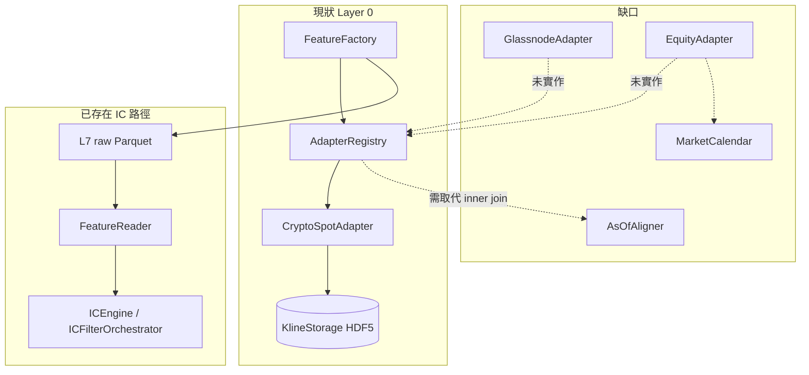

# 架構評估：多數據源擴充 × Feature Factory × IC Gatekeeper

**角色**：架構評估委員（read-only，Composer 2.5）  
**日期**：2026-06-17  
**方法**：`rg` + 直接讀檔；不附和「已有抽象層即可擴充」前提，以實際接線為準。

---

## 執行摘要

| 問題 | 判斷 | 往 IC Gatekeeper 的建議 |
|------|------|-------------------------|
| **Q1** 多數據源（Glassnode / CoinGecko / 台股 / 美股） | **不能輕易達成** | 與 IC 推進**解耦**；先完成 crypto 單域 FF→IC 閉環 |
| **Q2** Feature Factory 是否足夠支撐特徵研究 | **對現有 Binance crypto spot 足夠**；跨市場不足 | **有條件 GO**（crypto 域）；跨市場為 NO-GO 前置 |

**挑戰前提**：repo 同時存在 `DataSourceAdapter`（實際 Layer 0 路徑）與 `DataSourceRegistry`（metadata/legacy，Glassnode 範例僅在 `__main__`）。前者只有 1 個 adapter 被 factory 註冊；後者**未**接到 ingestion。文件/註解中的「未來擴充」≠ 可運行能力。

---

## 問題 1：多數據源串接能否輕易達成？

### ① 明確判斷：**不能輕易達成**

可重用：**介面骨架**（`base_adapter.py`）、**部分** Layer 1–6 的單序列指標管線、multi-TF 的 `TimeframeAligner`（跨 TF PIT 對齊）。  
不可重用為「加 adapter 即可」：**對齊語意、交易日曆、symbol 命名、storage、factory 註冊、config 接線、crypto 專屬欄位假設**。

### ② 具體缺口清單（檔案/行號佐證）

#### A. 數據源抽象：只有 crypto spot 真正接線

| 缺口 | 證據 |
|------|------|
| Factory 只註冊 `CryptoSpotAdapter` | `momentum/factories.py:232-246` — `AdapterRegistry()` + 單一 `registry.register(CryptoSpotAdapter(...))` |
| `market` 屬性存在但無分支消費 | `base_adapter.py:27-30` 定義 `market`；grep 顯示 Layer 0–7 **無** `adapter.market` / `market==` 路由 |
| `DataSourceConfig.adapters` schema 未使用 | `feature_config.py:18-36` 定義 `adapters: Dict[str, AdapterConfig]`；`create_feature_factory` 不讀此欄 |
| 第二套 registry 與 adapter 脫節 | `data_source_registry.py` — Glassnode/台股/美股僅 `register_*_sources()` 範例（L295-379），**未**在模組 import 時呼叫；`feature_factory.py` Layer 0 走 `_adapter_registry.fetch_aligned`，不走 `DataSourceRegistry` |
| 無 Glassnode / CoinGecko / 股票 adapter 實作 | `adapters/` 僅 4 檔：`base_adapter`, `adapter_registry`, `crypto_spot_adapter`, `__init__` |
| 無股票/鏈上 ingestion provider | `DataExtraction/providers/` 僅 `binance_provider.py`；`kline_storage.py` 預設 `data_source="binance"`（L743, L1433） |
| CoinGecko 僅存於歸檔文件 | `docs/Archived/Feature Generation Factory.md` P2 規劃，無程式碼 |

#### B. 對齊：`fetch_aligned` 不適合「鏈上日頻 + OHLCV 時頻」同欄合併

| 缺口 | 證據 |
|------|------|
| 跨 adapter **inner join**，無 resample/ffill/PIT 合併 | `adapter_registry.py:40-67` — 各 adapter `fetch(symbol, timeframe)` 後 `pd.concat(..., join="inner")` |
| `enabled_sources` 是**欄位名**，不是 adapter 選擇器 | 同上 L52：`col for col in enabled_sources if col in df.columns`；迴圈卻遍歷**所有**已註冊 adapter（L50-51） |
| `fetch_aligned` 不傳 `start_time`/`end_time` | `adapter_registry.py:40-45` 簽名無時間窗；`crypto_spot_adapter.fetch` 支援但 Layer 0 未透傳（`feature_factory.py:742`） |
| 日頻鏈上 vs 1h K 線同 TF 請求 → 索引交集極稀疏或為空 | inner join 語意：僅保留**完全相同 timestamp** 的列；日頻源若存成 `1d`、主 TF 為 `1h`，在 Layer 0 同次 fetch 無法對齊 |
| 跨 TF 對齊能力在 **multi-TF 路徑**，非 adapter_registry | `multi_tf_generator.py` 對每 TF 呼叫 `_layer0_data_ingestion`（L54, L162）；跨 TF 用 `TimeframeAligner.align_to_primary`（`tf_aligner.py:30-37` 註解 "avoid future leakage"）— **前提**是各 TF 已有獨立 OHLCV 管線，不是把 Glassnode 欄位塞進 spot adapter |

**挑戰前提**：「加 Glassnode adapter + enabled_sources 就能做特徵」— **不成立**；需新增 **as-of 對齊層**（或強制走 multi-TF + 專用 storage），並定義鏈上 metric 的發布延遲/PIT 規則。

#### C. 連續性 / 交易日曆：24/7 crypto 假設

| 缺口 | 證據 |
|------|------|
| 連續性檢查 = 固定秒數間隔，零容忍缺口 | `kline_storage.py:968-1044` — `time_diffs != timeframe_seconds` 即 `ValueError` |
| Crypto adapter 預設開啟連續性 | `crypto_spot_adapter.py:32-34, 62` — `validate_continuity=self._validate_continuity` |
| 批次/multi-symbol **普遍關閉**連續性 | `factories.py:268` `create_multi_symbol_runner` → `validate_continuity=False`；`feature_factory.py:4100` worker 同 |
| 無交易日曆、假日、時段、除權息、漲跌停 | grep `trading_calendar`/`holiday`/`ex_div`/`limit_up` 於 `FeatureEngineering/` **0 命中** |
| Layer 6 時間特徵假設 crypto 週末語意 | `meta_features/time_features.py:7-8, 56` — `IsWeekend` 註解「加密貨幣週末流動性低」；`dt.hour` 用 UTC，未接交易所當地時區 |
| multi-TF 僅 **log** gap，不改語意 | `multi_tf_generator.py:1170-1183` `_log_gap_source_if_any` |

**台股/美股影響**：要麼關 `validate_continuity`（掩蓋品質問題），要麼重寫 calendar-aware gap 策略；否則 Layer 1–3 rolling 會把收盤缺口當連續序列，**指標語意錯誤**（非單純 NaN）。

#### D. Crypto 耦合深度

| 耦合點 | 證據 |
|--------|------|
| Spot adapter **硬要求** taker 欄位 | `crypto_spot_adapter.py:75-87` — `taker_buy_volume`, `taker_ratio` 缺失即 `ValueError` |
| 預設 enabled_sources 含 `taker_ratio` | `feature_config.py:26-31` |
| Layer 1 微結構引擎綁 taker/quote | `atomic/microstructure_indicators.py:119-126, 214-218` |
| EMA extractor 預設 taker 距離特徵 | `indicators/ema_extractor.py:189-198` |
| `funding_rate`/`open_interest` 在 config 白名單但**無資料路徑** | `config_manager.py:238-239` allowed；無 adapter 提供；`feature_factory.py` 無 `funding` |
| Cross-sectional 預設 ref = BTCUSDT | `feature_config.py:358-359` |
| Layer 5 變數命名 btc_* | `feature_factory.py:1772-1786` — `btc_close`, `btc_returns` |
| 批次預載 ref 預設 BTCUSDT | `feature_factory.py:3894` `ref_symbol: str = "BTCUSDT"` |
| Worker **硬編碼** cache key `("BTCUSDT", tf)` | `feature_factory.py:4109` — 即使 `run_multi_symbol(ref_symbol=...)` 傳其他 symbol，worker 仍寫入 BTCUSDT key → **跨截面 ref 靜默錯誤** |
| API 預設 reference_symbol | `api/services/feature_factory_service.py:3793` |

#### E. Layer 1–6 對「OHLCV + enabled_sources」的泛用性

| 層級 | 泛用性 | 說明 |
|------|--------|------|
| L0 | **低** | 僅 adapter 輸出欄位；crypto 必填 taker |
| L1 | **中** | TA-Lib 七類對任意 `enabled_sources` 單序列可跑（`feature_factory.py:791-818`）；volume/microstructure 綁 crypto 欄位 |
| L2–L4 | **中高** | 衍生/rolling/lag 主要依 L1 輸出與 OHLCV |
| L5 | **低** | 需 `reference_symbol` 的 spot close；語意為 crypto beta |
| L6 | **中** | meta/time 特徵偏 crypto；可 config 關閉 |

### ③ 風險分級（Q1）

| 等級 | 風險 | 說明 |
|------|------|------|
| **P0** | inner join 跨頻率合併 | 鏈上日頻 + 時頻 K 線：資料大量丟失或全空，且無 PIT as-of |
| **P0** | 股票交易日曆缺失 | 連續性/rolling/標籤對齊全面失真 |
| **P1** | 雙 registry 假象 | 開發者以 `DataSourceRegistry.register()` 以為 FF 能讀到新欄位 |
| **P1** | symbol 命名空間 | `2330.TW` / `AAPL` / `BTCUSDT` 與單一 `fetch(symbol, timeframe)` 契約未設計 |
| **P1** | `ref_symbol` worker bug | 多 symbol 批次 cross-sectional 結果不可信 |
| **P2** | time_features 週末/時區 | 股票需交易所時區與交易時段特徵 |
| **P2** | CoinGecko 全域指標 | 非 per-symbol 序列，需 cross-section 或 macro 層，現 L5 只做 ref symbol |

### ④ Q1 對「往 IC Gatekeeper 推進」的建議

- **與 IC 推進無直接衝突**，但**不應**把「多數據源」當 IC 前置。
- **建議**：IC Gatekeeper 先在 **現有 crypto kline_cache** 上跑通；多數據源單開 epic。

**前置條件（若堅持要做多數據源）**：

1. 實作 ≥2 個真實 adapter（鏈上、股票）+ factory 動態註冊（讀 `DataSourceConfig.adapters` 或等價 DI）。
2. 新增 **AsOfAligner**（取代或擴展 `fetch_aligned`）：支援 `join="asof"`、發布延遲、不同 native 頻率。
3. **MarketCalendar** protocol：crypto 24/7 vs exchange session；與 `validate_continuity` 分離。
4. 放寬/拆分 crypto_spot `required` 欄位；微結構引擎改為 optional。
5. 統一 symbol 規範 + 獨立 HDF5/cache 命名空間（防 cross-symbol 污染）。
6. 修 `feature_factory.py:4109` ref cache key 與 `reference_symbol` 一致。
7. 刪除或合併 `DataSourceRegistry`，避免雙軌。

---

## 問題 2：Feature Factory 是否足夠？能否進 IC Gatekeeper？

### ① 明確判斷

- **對「Binance crypto spot、現有 kline_cache、單/多 symbol、multi-TF」特徵研究：足夠進入 IC 階段。**
- **對「多市場、鏈上、股票」：不足**，應先 Q1 缺口。
- **不應**因 FF 功能多就假設 PIT/資料正確性已簽核——專案規則要求真實 kline 三方驗證；本評估僅做**程式路徑**審查。

### ② FF 能力與風險（檔案佐證）

#### 管線成熟度（crypto 域）

| 能力 | 狀態 | 證據 |
|------|------|------|
| Layer 0–7 + CGSA + L6.5 三態 | 已實作 | `feature_factory.py:327-414` 主路徑；`_resolve_l65_generation_mode` L2434-2459 |
| IC-First（L6.5 pre_ic → L7 raw → IC 選特徵） | 已實作 + 測試 | `test_ic_first_pipeline.py` 550+ 行；`test_l7_raw_streaming.py` |
| Multi-TF PIT 對齊 | 已實作 + 測試 | `tf_aligner.py`；`test_open_minus_no_future_leak_for_lower_tf` 等 |
| V2 manifest + Parquet 輸出 | 已實作 | `feature_reader.py`；`feature_storage.py` |
| 失敗隔離 / fail-open / run lifecycle | 已實作 | `test_failopen_*.py` 系列；`run_lifecycle.py` |
| batch_alias / multi-symbol | 近期完成 | `HANDOFF.md` 2026-06-17 |

#### PIT / leakage 審查

| 元件 | PIT 安全？ | 證據與殘留風險 |
|------|-----------|----------------|
| **L3 RollingAggregator** | **是**（因果 rolling） | `rolling_aggregator.py` 使用 `.rolling(window)` 無 `center=True` |
| **L4 lag** | **是**（設計為 lag） | 標準 shift 語意 |
| **L5 cross-sectional** | **條件安全** | 同 timestamp inner align（`feature_factory.py:1773-1776`）；ref 與 symbol 須同 TF、同 calendar；beta rolling window=60（`relative_strength.py:24-28`） |
| **Multi-TF** | **是**（有測試） | `TimeframeAligner.build_asof_index_map` backward；`validate_no_future_leak` |
| **L6.5 winsor/rank/zscore** | **預設安全** | `causal_preprocessing` 預設 `True`（`feature_preprocessor.py:147`）；`rolling_winsorize_array` 註解 "Causal"（`_numba_transforms.py:382`）；`test_causal_winsor.py`, `test_ff_causal_golden.py` |
| **L6.5 FracDiff d\*** | **部分安全** | `causal_preprocessing=True` 時 `_calibration_series` 僅用前 500 bar 估 d\*（`feature_preprocessor.py:170-172, 3734`）；**非** walk-forward 每 fold 重估；`causal_preprocessing=False` 時全樣本 quantile winsor（`feature_preprocessor.py:2719-2731`）— **洩漏** |
| **L6.5 legacy rank/zscore/Gaussian** | IC-First 路徑關閉 | `_layer6_5_pre_ic` 關 rank/zscore/gaussian（`feature_factory.py:2357-2363`） |
| **IC 選特徵窗口** | 有 gate | `ICEngine.compute_ic_from_l7_raw` 要求 `label_horizon` + `selection_window`/`split_id`（`ic_engine.py:127, 446-454`）；`test_ic_selection_no_oos_leakage` |

**挑戰前提**：「Layer 6.5 已 IC-First 所以無洩漏」— **不完全成立**：d\* 固定用序列前 500 bar，對超長樣本或 regime change 是**研究偏差**；legacy 模式仍可用全樣本 winsor（需確認 UI 預設）。

#### IC Gatekeeper 現況與 FF 銜接

| 模組 | 狀態 |
|------|------|
| `ICFilterOrchestrator` | 八階段流水線（`ic_filter_orchestrator.py:68-80`） |
| `ICEngine` | L7 raw 串流 IC（`ic_engine.py:104-147`） |
| 周邊分析器 | coverage, turnover, redundancy, walk-forward CV, net_ic, factor_exposure 等 20+ 模組於 `momentum/Analysis/` |
| Factory 入口 | `create_ic_analyzer` → `ICFilterOrchestrator`（`factories.py:441-446`） |
| API | `api/routes/ic_analysis.py` REST；`ic_analysis_service.compute_ic_from_l7_raw`（L346-378） |
| FF 輸出消費 | `FeatureReader.stream_groups_v2` / `list_features`；`ColumnGroupRegistry.iter_all` 供 CGSA/L6.5；IC 讀 `raw/` parquet + `feature_manifest.json` |

**銜接判斷：接得上。** 關鍵契約是 **V2 manifest + L7 raw parquet + config_hash 路徑**，不是 `materialize_wide_df`（已 deprecated，`column_group_registry.py:1638`）。

殘留整合風險：

- IC 與 FF 的 `selection_window` / label 生成需與使用者策略一致（否則 IC 選出的特徵對回測標籤無意義）。
- `CoverageAnalyzer` 仍有 HDF5 fallback（`coverage_analyzer.py`）；新 run 應走 Parquet。
- 真實 kline 端到端 IC-First 三方簽核：**本評估未執行**（無跑批證據）。

### ③ 風險分級（Q2 / FF）

| 等級 | 風險 |
|------|------|
| **P0** | 資料正確性未以真實 `kline_cache.h5` 做端到端簽核即宣稱 production-ready |
| **P1** | `causal_preprocessing=False` 或 legacy L6.5 全開 → 全樣本統計量洩漏 |
| **P1** | FracDiff d\* 僅首 500 bar 校準 → 長樣本 regime 漂移 |
| **P1** | `feature_factory.py:4109` 批次 ref cache BTC 硬編碼 |
| **P2** | L5 預設 BTC 參考不適用非 crypto basket |
| **P2** | `time_features` 對 12h 僅 {0,12} 小時（`time_features.py:20-24`）— 雜訊特徵，IC 應篩掉 |
| **P2** | inner join 式資料缺口在 crypto 也會發生（多源未對齊時） |

### ④ Q2 對「往 IC Gatekeeper 推進」的 Go/No-Go

#### 建議：**有條件 GO**（crypto 研究主線）

**GO 條件（建議順序）**：

1. **域限定**：IC 輸入限定 `data_cache/feature_klines/kline_cache.h5` 已支援 symbol×TF；不混入未驗證新源。
2. **路徑限定**：走 **IC-First**（`ic_first_pipeline` / L6.5 pre_ic → L7 raw → `ICEngine.compute_ic_from_l7_raw`），避免 legacy 全樣本 L6.5。
3. **元資料強制**：每次 IC run 帶 `label_horizon` + `selection_window` 或 `split_id`（引擎已強制，L446-454）。
4. **修 P1 bug**：`feature_factory.py:4109` ref cache key 應使用 config `cross_sectional.reference_symbol`，非硬編碼 BTCUSDT（若用批次 + L5）。
5. **驗收門檻**：至少一輪真實 kline FF run → IC 串流 → 選特徵 JSON 產出（可沿用 `test_ic_first_pipeline.py` 模式升級到真實 cache，符合專案三方簽核規則）。
6. **明確不做**：在 IC 階段同時接 Glassnode/股票（避免把 IC 失敗誤判為 Gatekeeper 問題）。

#### No-Go 觸發條件

- 使用者目標是**台股/美股/鏈上**為主 → 先 Q1，**No-Go IC 全面推廣**。
- 堅持 `causal_preprocessing=False` 或 full legacy L6.5 做 IC 排名 → **No-Go**（洩漏）。
- 無 `selection_window`/split 紀律的「全歷史 IC 選特徵」→ **No-Go**。

---

## 架構示意（現狀 vs 目標）



---

## 委員會結論（挑戰性總結）

1. **「已有 adapter 抽象」是必要非充分條件**；目前產線仍是 **Binance crypto spot 單通道**。
2. **`fetch_aligned` + inner join 與「鏈上日頻 + 時頻 OHLCV」目標根本不相容**；必須單獨設計 as-of 合併，不能指望 `enabled_sources` 加欄位名。
3. **`DataSourceRegistry` 與 Glassnode 範例函式是文件級別**，會誤導非工程使用者以為「已支援鏈上」。
4. **Feature Factory 在 crypto 域已具研究級深度**（7 層 + CGSA + IC-First + 大量測試），**可以且應該**推進 IC Gatekeeper——但範圍要**刻意收窄**。
5. **最大技術債不是 IC 模組缺失**（IC 已相當完整），而是 **資料域擴張未開始 + 少數 crypto 硬編碼 + 雙 registry 認知落差**。

---

## 驗證命令（供後續執行端複核）

```bash
# 解耦與 adapter 現狀
rg "registry.register" momentum/factories.py
ls momentum/FeatureEngineering/adapters/
rg "join=\"inner\"" momentum/FeatureEngineering/adapters/adapter_registry.py

# crypto 耦合
rg "BTCUSDT|taker_ratio|funding_rate" momentum/FeatureEngineering/feature_factory.py momentum/FeatureEngineering/adapters/

# IC 銜接
rg "compute_ic_from_l7_raw|FeatureReader" momentum/Analysis/ic_engine.py api/services/ic_analysis_service.py

# PIT 測試存在性
pytest tests/feature_engineering/test_ic_first_pipeline.py tests/feature_engineering/preprocessing/test_causal_winsor.py -q --tb=no
```

---

**HANDOFF_NOT_UPDATED**: read-only 諮詢任務；依使用者指示僅寫入本 handoff 評估檔，不修改根 `HANDOFF.md`。

**STATUS: DONE**
