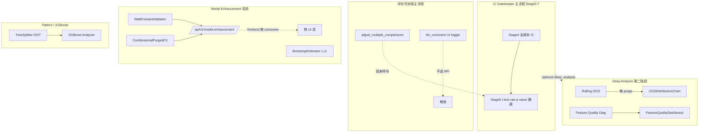

# 階段三—統計嚴謹度與防偽 · 獨立版（Cursor Round 1）

**查證範圍**：`momentum/Analysis/` IC 主流程、`api/services/ic_analysis_service.py`、`frontend/src/app/ic-analysis/`、Model Enhancement 孤島模組。  
**使用者處境**：泛用平台、case-control 主戰、430K bar × 20K feature × 百 symbol。  
**查證日期**：2026-06-24（repo 當前 working tree）。

---

## 總覽（wiring 優先）

| # | 分析類型 | 全棧判定 | 一句話 |
|---|---------|---------|--------|
| 1 | IC 顯著性 | 🔌 後端有、前端部分有 | 主流程有 t/p/CI 計算，但 **無 IC bootstrap、無 HAC**；CI 未進 summary/UI |
| 2 | FDR / 多重比較 | ⛓️‍💥 兩端有但沒連結 | 後端 `_fdr_bh` 存在，**orchestrator 從未呼叫**；前端 toggle **不送 API** |
| 3 | Block Bootstrap / Clustered SE | ❌ 完全缺 | IC 路徑零實作；僅 XGBoost 有 i.i.d. bootstrap |
| 4 | Train/Test Split（主路徑） | 🔌 模組存在、IC 主路徑未接 | IC `analyze()` **全樣本 in-sample**；TimeSplitter 在 pattern/XGBoost |
| 5 | Walk-Forward / Rolling OOS | 🔌 deep-tab 有、主路徑無 | IC 有 `RollingOOSValidator`（deep）；WF/CPCV 在 model-enhancement **無前端頁** |
| 6 | Purged / CPCV | 🔌 ML 孤島、IC 未接 | `PurgedTimeSeriesSplit`+CPCV 完整，但 **IC Gatekeeper 不用** |
| 7 | 極端值影響診斷 | 🔌 預處理有、診斷缺 | Stage1 winsorize 有；**無「極端值對 IC 敏感度」**專項 |

---

## 1. IC 顯著性（t-stat / p-value / bootstrap CI）

| 欄 | 內容 |
|----|------|
| **1 🔍 核心問題** | 這個因子的 IC 是「真訊號」還是「噪音碰巧看起來不錯」？ |
| **2 📐 業界標準** | 對 rolling IC 序列做 mean IC 的 t 檢定；序列有自相關時用 **Newey-West / block bootstrap CI**；bootstrap 應 **block** 保留時間結構。 |
| **3 🗂 資料形狀** | 輸入：`rolling_ic_dict[feature → window→Series]` 或 flat list；每 feature 一組 IC 觀測值；輸出：`t_stat, p_value, ci_lower, ci_upper, n_observations`。 |
| **4 📊 平台現況** | `StatisticalValidator.compute_ic_statistics()`（`statistical_validator.py:24-128`）對 rolling IC 做 **i.i.d. 假設** 的 `ttest_1samp` + 常態 CI。Stage5 `_stage5_statistical_validation()`（`ic_filter_orchestrator.py:1154-1202`）對 **全部 feature 欄位** 算 stats，用 **raw p_value** 過 `_apply_thresholds()`。`BootstrapEstimator`（`bootstrap_estimator.py`）只做 **AUC/Brier 等 ML 指標**，與 IC 無關。 |
| **5 🧩 全棧狀態** | **後端**：✅ 主流程 Stage5 有。**前端**：🔌 `ICSummaryTable` 顯示 p-value；t-stat 僅 cross-sectional 時 **前端推算**（`ICSummaryTable.tsx:75-96`），global 模式 summary **不含 t_stat**（`ic_reporter.py:155-173` 只 export p_value）。**CI / bootstrap**：❌ 未暴露 UI。**判定**：🔌 後端有、前端部分有、統計方法不完整。 |
| **6 🛡️ PIT 與洩漏** | p-value 本身不引入 look-ahead；但若 rolling IC 視窗或 label 對齊有 bug，顯著性會「假綠」。目前 **未校正 IC 序列自相關 → p-value 偏樂觀（anti-conservative）**。 |
| **7 ⚡ 430K×20K 對策** | 複雜度 O(特徵數 × rolling 點數)；20K feature 全算 stats **可行但重**；無 subsampling/FDR 前置。Bootstrap 若加在 IC 上 ×20K 會 **不可接受**，需只對 top-N 或 block 近似。 |
| **8 🔧 做對沒/漏洞** | ❌ 把 rolling IC 當 i.i.d.（量化文獻常判 inadequate）。❌ `apply_significance_filter()` 存在但 **Stage5 未呼叫**。❌ CI 算了但未進 report/UI。❌ 無 IC block bootstrap。 |
| **9 🏷️ 優先級** | **P0** — 主篩選 gate 直接依賴 p_value；方法論缺口會在 20K 多重測試下放大。 |

---

## 2. FDR / 多重比較校正（Bonferroni / Benjamini-Hochberg）

| 欄 | 內容 |
|----|------|
| **1 🔍 核心問題** | 測 2 萬個因子時，光運氣就會有很多「p<0.05」——哪些是假陽性？ |
| **2 📐 業界標準** | 對全部 feature 的 p-value 做 BH-FDR 或 Bonferroni；篩選用 **adjusted p** 或 q-value；報告同時列 raw vs adjusted。 |
| **3 🗂 資料形狀** | 輸入：`dict[feature_name → p_value]`，長度 = 測試 feature 數（可達 2万）；輸出：同 key 的 adjusted p。 |
| **4 📊 平台現況** | `StatisticalValidator.adjust_multiple_comparisons()` + `_fdr_bh` / `_bonferroni`（`statistical_validator.py:58-166`）**實作正確**。但 **全 repo 僅 tests 呼叫**（`test_statistical_validator.py:44-57`），`ic_filter_orchestrator` Stage5 **零引用**。前端 `FeatureTierPanel` 有 `fdr_correction` toggle（L3），但 `icAnalysisStore.getEffectiveConfig()` **不把 fdr 送進 `custom_overrides`**（`icAnalysisStore.ts:290-325`）；後端 `ICConfig` schema **無 fdr 欄位**。 |
| **5 🧩 全棧狀態** | **後端**：🎨 函式有、**主流程空殼**。**前端**：🎨 checkbox 可點、**靜默無效**。**判定**：⛓️‍💥 兩端都有「影子」，但 **沒連結** — 使用者以為開了 FDR，實際仍 raw p。 |
| **6 🛡️ PIT 與洩漏** | FDR 本身無洩漏；未做 FDR 在 20K 測試下 **假陽性率失控**（統計風險，非 PIT）。 |
| **7 ⚡ 430K×20K 對策** | BH/Bonferroni 對 2万 p-value **O(n log n)**，計算便宜；**必須全量收 p** — Stage5 已對全部 columns 算 p，**資料面可支撐**，只是沒套用校正。 |
| **8 🔧 做對沒/漏洞** | 🔴 **高風險假綠**：UI 宣稱 FDR，後端從未執行。易混淆：`event_filter.check_sample_size()` 的 `adjusted_p_threshold`（0.05/0.10）是 **樣本量 tier 放寬**，不是 FDR（`event_filter.py:128-144`）。 |
| **9 🏷️ 優先級** | **P0** — 20K feature 場景下這是「防運氣」第一防線，且 UI 已誤導。 |

---

## 3. Block Bootstrap / Clustered SE

| 欄 | 內容 |
|----|------|
| **1 🔍 核心問題** | IC 序列相鄰高度相關，普通 t 檢定和 i.i.d. bootstrap 的標準誤是否太窄？ |
| **2 📐 業界標準** | Block bootstrap（保留時間塊）或 Newey-West HAC 標準誤；crypto 事件序列常取 block length ≈ half-life 或 sqrt(T)。 |
| **3 🗂 資料形狀** | 每 feature 一條 `{t → IC_t}` 序列；block bootstrap 在時間索引上重抽；輸出 SE、CI、p-value。 |
| **4 📊 平台現況** | **IC 路徑**：grep `Newey|HAC|block_bootstrap|clustered` in `momentum/` → **0 結果**。`BootstrapEstimator.bootstrap_confidence_interval()` 用 **有放回 i.i.d. 索引重抽**（`bootstrap_estimator.py:82-88`），接 XGBoost/pattern 分析，非 IC。`FeatureQualityDiagnostics._effective_sample_ratio()` 用 ACF 估有效樣本比（`feature_quality_diagnostics.py:311-318`），在 quality diag 模組，**未回灌 IC 顯著性**。 |
| **5 🧩 全棧狀態** | **後端 IC**：❌ 無。**後端 ML**：⚠️ 有 i.i.d. bootstrap（方法不對 IC）。**前端**：❌ 無。**判定**：❌ 對 IC 完全缺；對 ML 有但非 block 版。 |
| **6 🛡️ PIT 與洩漏** | 無直接洩漏；未校正自相關 → **過度拒絕 H0 失敗**（把噪音當顯著），等價於「統計上的假綠」。 |
| **7 ⚡ 430K×20K 對策** | Block bootstrap ×20K × 1000 resamples **不可行**；需 top-K 預篩 + 較少 resample，或解析式 HAC（O(T) per feature）。 |
| **8 🔧 做對沒/漏洞** | 與 #1 同源：Stage5 t-test 在 case-control 事件序列（樣本常叢集）下 **尤其不可靠**。 |
| **9 🏷️ 優先級** | **P1** — 方法論重要，但實作成本高；可先 HAC，再 block bootstrap for top-N。 |

---

## 4. Train/Test Split（主路徑）

| 欄 | 內容 |
|----|------|
| **1 🔍 核心問題** | 會不會在「同一段時間」上既挑因子又宣稱有效（in-sample 過擬合）？ |
| **2 📐 業界標準** | 時間序 strictly：train 估 IC/篩因子 → hold-out test 只做一次確認；case-control 也要按 **時間** 切，不能 random split。 |
| **3 🗂 資料形狀** | `(timestamp × feature matrix, label)`；切分後 train/test 索引 disjoint；case-control：事件列仍須時間有序。 |
| **4 📊 平台現況** | IC 主流程 `analyze()`：Stage0→7 **同一 `features_df/label_series` 全量** 算 IC + 篩選（`ic_filter_orchestrator.py:93-160, 1092-1152`），**無 hold-out**。`TimeSplitter`（`time_splitter.py`）+ `create_time_splitter()` 用於 **`api/routes/pattern_analysis.py`**（XGBoost/pattern 路徑），非 IC Gatekeeper。Stage1 `DataPreprocessor.winsorize()` 在全樣本上 fit 分位數（`data_preprocessor.py:78-105`）→ **strict OOS 下應只在 train fit**。 |
| **5 🧩 全棧狀態** | **IC 主路徑**：❌ 無 train/test。**獨立模組**：✅ TimeSplitter 後端有。**前端 IC 頁**：❌ 無切分 UI/結果。**判定**：🔌 模組存在、IC 主流程未接。 |
| **6 🛡️ PIT 與洩漏** | 全 in-sample IC 排名 + 閾值篩選 = **選因子與評估同一數據**；winsorize 全樣本分位 = 輕度 leakage。Case-control 事件子集若時間跨度短，問題更嚴重。 |
| **7 ⚡ 430K×20K 對策** | 全量算兩遍（train+test）成本 ×2；實務上應 **train 篩到 top-K → test 只驗 K**，非 20K 全驗。 |
| **8 🔧 做對沒/漏洞** | 🔴 IC Gatekeeper 定位是「篩因子」，但 **缺少 mandatory OOS hold-out**；Rolling OOS（#5）在 deep tab，非主 gate。 |
| **9 🏷️ 優先級** | **P0** — 與 case-control 主戰直接相關；使用者易把 in-sample 通過當「策略有效」。 |

---

## 5. Walk-Forward / Rolling OOS

| 欄 | 內容 |
|----|------|
| **1 🔍 核心問題** | 訊號會不會只在某段時間有效，換個窗口就崩（ regime / 過擬合）？ |
| **2 📐 業界標準** | Rolling/expanding WF：多窗口 train→test IC 或 AUC；報 IS/OOS gap、hit rate、degradation。 |
| **3 🗂 資料形狀** | 對齊的 `(feature, label)` 序列；`train_window/test_window/step`；輸出每 split 的 IS/OOS IC。 |
| **4 📊 平台現況** | **IC 域**：`RollingOOSValidator`（`rolling_oos_validator.py`）Spearman IC rolling split；經 `run_deep_analysis()` → `_run_rolling_oos()`（`ic_filter_orchestrator.py:809-815`），**非 Stage1-7 主流程**。預設 deep 只跑 **selected/passed features**（非 20K 全跑）。**無 purge/embargo**（grep rolling_oos → 無）。**ML 域**：`WalkForwardValidator`（`walk_forward_validator.py`）在 `model_enhancement_service.py`，評 **AUC** 非 IC；API `/api/v1/model-enhancement/walk-forward` 存在，**frontend 無任何 fetch**；`WalkForwardTimeline.tsx` **未被 import**。 |
| **5 🧩 全棧狀態** | **IC Rolling OOS**：🔌 deep tab — `OOSDistributionChart`（`page.tsx:805`），需 `deep_analysis=true` + 手動/自動 second step。**Walk-Forward (ML)**：🔌 後端完整、**前端孤島**。**Case-control**：event filter 後資料 **會進** rolling OOS（同一 `_ic_cache`），但須使用者開 deep。**判定**：🔌 後端有、主 gate 無；ML WF ⛓️‍💥 斷鏈。 |
| **6 🛡️ PIT 與洩漏** | Rolling split 按索引順序 ✅；缺 purge → label horizon>1 時 **train 末段可能污染 test**（`rolling_oos_validator.py` 無 gap）。WF/CPCV 的 purge 只在 ML 模組。 |
| **7 ⚡ 430K×20K 對策** | `validate_batch` 跑 `len(selected)` features；每 feature 多 splits × Spearman → 只應 **top-N（目前跟 selected 走）**；20K 全跑 OOS 不現實。 |
| **8 🔧 做對沒/漏洞** | Deep tab 預設 intermediate preset 才開（foundation **關 deep**）；使用者可能只看 summary p-value 以為夠。OOS chart **只顯示前 15 個** feature（`OOSDistributionChart.tsx:20`）。 |
| **9 🏷️ 優先級** | **P1** — 已有 IC 版 OOS，應 **升格进主 gate 或 mandatory deep**；ML WF 對 IC 使用者次要。 |

---

## 6. Purged / Combinatorial Purged CV

| 欄 | 內容 |
|----|------|
| **1 🔍 核心問題** | 交叉驗證是否因 label 用未來收益而「偷看」？多路徑 CV 是否穩健？ |
| **2 📐 業界標準** | Lopez de Prado：purge gap + embargo；CPCV 估 PBO/分佈；用於 **ML 訓練** 與 factor selection 防過擬合。 |
| **3 🗂 資料形狀** | `X(n×p), y(n)` 時間序；CPCV：`n_groups, n_test_groups, purge_gap, embargo_pct, max_paths`。 |
| **4 📊 平台現況** | `PurgedTimeSeriesSplit`（`time_splitter.py:480+`）— XGBoost/LightGBM 用（`xgboost_analyzer.py:27`）。`CombinatorialPurgedCV`（`combinatorial_purged_cv.py`）完整實作 + tests。入口：`model_enhancement_service.execute_cpcv()`；**IC orchestrator 零引用**。 |
| **5 🧩 全棧狀態** | **後端 ML**：✅ 有。**後端 IC**：❌ 無。**前端**：`CPCVPathChart.tsx` 存在但 **無頁面引用**；`modelEnhancementStore.ts` 無 consumer。**判定**：🔌 ML 孤島；IC ⛓️‍💥 未接。 |
| **6 🛡️ PIT 與洩漏** | ML 路徑 purge/embargo ✅。IC 主流程 + Rolling OOS **未 purge** → case-control + multi-horizon label 有 **結構性洩漏風險**。 |
| **7 ⚡ 430K×20K 對策** | CPCV 組合爆炸；`max_paths` 預設 50。對 IC screening 不適用全 CPCV；更合理是 **purged single hold-out** 或 purged rolling IC。 |
| **8 🔧 做對沒/漏洞** | 能力在 ML 堆疊，**IC Gatekeeper 用不了**；對「只做 IC 分析、不跑 XGBoost」的使用者等於 **功能不存在**。 |
| **9 🏷️ 優先級** | **P2（IC 路徑）/ P1（ML 路徑 UI）** — 先把 purge 接到 IC Rolling OOS 比整包 CPCV 更 urgent。 |

---

## 7. 極端值影響診斷

| 欄 | 內容 |
|----|------|
| **1 🔍 核心問題** | 這個 IC 是不是被少數極端 bar / 極端事件撐起來的？ |
| **2 📐 業界標準** | Winsorize/trim 前後 IC 對比；leave-one-out 或 top-k 移除後 IC 變化；Spearman 下也應報 **rank sensitivity**。 |
| **3 🗂 資料形狀** | `(feature, label)` 對齊序列；輸出 `ic_full, ic_winsorized, ic_drop_top1pct, delta, flag`。 |
| **4 📊 平台現況** | **Stage1 預處理**：`DataPreprocessor.winsorize()` 預設 percentile 1–99（`data_preprocessor.py`），**改寫特徵值** 後再算 IC — 這是 **處置** 不是 **診斷**。`FeatureQualityDiagnostics`（Module 9）：ADF/Ljung-Box/漂移/覆蓋率；ADF 內部 `_winsorize`（`feature_quality_diagnostics.py:305-308`）僅為 ADF 穩定，**不報 IC 敏感度**。`net_ic_analysis` 是成本調整 IC，非極端值。**無** leave-one-out IC / influence diagnostic 專模組。 |
| **5 🧩 全棧狀態** | **後端**：🔌 winsorize 在主流程；quality diag 在 **deep tab**（`FeatureQualityDashboard.tsx` + `page.tsx:820`）。**前端**：quality dashboard 顯示定態率/覆蓋率/漂移 flag，**無極端值 IC 對照**。**判定**：🔌 有相近模組、**目標診斷缺**。 |
| **6 🛡️ PIT 與洩漏** | Winsorize 在全樣本 fit 分位 → 輕度 leakage（見 #4）。診斷缺失不造成洩漏，但 **掩蓋脆弱因子**。 |
| **7 ⚡ 430K×20K 對策** | 逐 feature 做 LOO 不可行；應 **抽樣 bar + 僅 top-K** 做 trimmed IC 對照。 |
| **8 🔧 做對沒/漏洞** | 使用者可能以為 winsorize toggle =「已診斷極端值」；實際只是 **預先 clip**，且無 before/after IC 報告。Case-control 極端事件常是 signal 本身，更需要 **對比報告** 而非 silent winsorize。 |
| **9 🏷️ 優先級** | **P1** — 量化上常見「一兩個 event 騙過 Spearman」；與 case-control 主戰高度相關。 |

---

## 跨類型 wiring 圖（簡化）

---

## 優先級匯總（建議）

| 優先級 | 項目 | 理由 |
|--------|------|------|
| **P0** | #2 FDR 接 Stage5 + 修 UI 假開關 | 20K 測試 + UI 誤導 |
| **P0** | #4 IC 主路徑 mandatory 時間 hold-out | in-sample 篩選 = 過擬合主因 |
| **P0** | #1 修正 IC 顯著性（至少 HAC 或 block CI for top-K） | 現 p-value 偏樂觀 |
| **P1** | #5 Rolling OOS 加 purge + 升格為 gate 或 default deep | case-control + horizon |
| **P1** | #7 極端值 IC 對照診斷（top-K） | 主戰場事件研究 |
| **P1** | #3 Block bootstrap / HAC | 與 #1 同批 |
| **P2** | #6 CPCV 接 IC 或 ML enhancement UI | 能力已有，缺 product wiring |

---

## 誠實邊界

- 以上 **第 4、5 欄** 均來自 repo 讀碼；未跑 live 430K run，perf 數字為複雜度推論。
- **未驗證**：WebSocket 深層序列化是否丟 `t_stat`/`ci_*`（summary builder 已確認不含 t_stat）。
- **`HANDOFF_NOT_UPDATED`**：本任務 READ-ONLY，依合約不寫根 `HANDOFF.md`。

---

**STATUS: DONE**（Round 1 獨立地圖，待互審）
