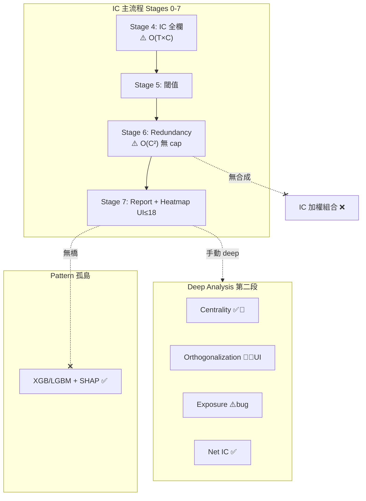

使用者可稽核：cat .claude/gate/audit.log
# 階段五—多因子與系統觀 獨立版（Cursor Round 1）

> **讀碼範圍**：`momentum/Analysis/{redundancy_filter,ic_filter_orchestrator,ic_engine,factor_*}.py`、`api/models/ic_models.py`、`api/services/{ic_analysis_service,shap_analysis_service}.py`、`frontend/src/app/{ic-analysis,patterns/xgboost-analysis}/`、`ic_config_schema.py`、`config/ic_config.yaml`。  
> **使用者場景**：泛用平台、ML-first、主戰場事件 case-control、430K 特徵 × ~20K 列 × 百 symbol。

---

## 總覽：階段五在問什麼

「這個因子跟**已入選的其他因子**比，有沒有**獨立新資訊**？」— 不是單因子 IC 強不強（階段一～四），而是**系統內相對位置**：冗餘、正交、擁擠、非線性邊際貢獻、風格暴露、合成後是否仍有效。

| # | 分析類型 | 一句話 |
|---|---------|--------|
| 1 | 相關 / Clustering / VIF | 跟誰重複？留誰代表？ |
| 2 | 正交化 / Neutralized IC | 扣掉已知因子後還有殘差訊號嗎？ |
| 3 | 擁擠 / Centrality | 是不是大家都擠在同一個主成分上？ |
| 4 | 非線性 ML 重要性 | 樹模型認為誰在驅動 label（IC 看不到的交互）？ |
| 5 | 因子暴露 / 歸因 | 賺的是 Beta 還是 Alpha？ |
| 6 | 多因子組合 | 多弱合成一強，權重怎麼配、合成後 IC 還在嗎？ |

---

## 1. 相關 / Clustering / VIF（冗餘）

| 欄 | 內容 |
|----|------|
| **🔍 核心問題** | 這特徵是否與已保留特徵高度相關（講同一件事）？應剔除還是當代表？ |
| **📐 業界標準** | Pearson/Spearman 相關矩陣 → 貪婪去重 / 階層聚類（距離=1−\|ρ\|）/ VIF 逐步剔除；tie-break 用 ICIR；報告 avg/max 相關與 effective independent features。 |
| **🗂 資料形狀** | 輸入：`features_df` 為 **T 列 × C 列**（C = Stage 5 通過閾值的特徵）；輸出：C×C 相關矩陣 + 保留子集 + diversification metrics。 |
| **📊 平台現況+實作** | `RedundancyFilter`（`redundancy_filter.py`）實作 greedy / hierarchical / VIF 三法；`compute_correlation_matrix` 用 `values.T @ values` 全矩陣。**Stage 6 主流程**在 `ic_filter_orchestrator.py:138-144` → `_stage6_redundancy`（`:1204-1240`）對 `passed_features` 子集過濾。報告含 `correlation_matrix` + `diversification_metrics`。**配置**有 `performance.max_features_for_correlation: 200`（`ic_config_schema.py:155`），但 **grep 全 `momentum/` 僅 schema 一處引用—執行路徑未讀此欄**。 |
| **🧩 全棧狀態** | 後端 **✅**（Stage 6 主流程）｜前端 **✅** `CorrelationHeatmap`（主報告 tab，非 deep）｜連結 **⚠️**：後端可算完整 survivor 矩陣，前端 **硬裁 18 列**（`CorrelationHeatmap.tsx:21` `maxFeatures=18`）｜綜合：**✅ 主流程連通，但 UI 只窺一角** |
| **🛡️ PIT 洩漏防禦** | 相關在**同一 train 視窗**內橫截面算；event filter（Stage 3）先裁行。無跨 split 重算相關的機制—若全樣本算相關再切 test 會洩漏（現況跟主 IC 同視窗）。cross-sectional 模式有 symbol 維度隔離（Stage 4 另路）。 |
| **⚡ 430K 尺度** | 複雜度：**O(T×C) 建矩陣 + O(C²) 相關 + VIF 迭代 O(C²×C)**。Stage 6 輸入 C = `passed_features`（Stage 5 閾值後），**無程式內 candidate cap**。若 C≈430K → corr 矩陣 ~1.8×10¹¹ floats ≈ **OOM 必爆**。`max_features_for_correlation=200` **未接線**。Stage 4 已對**全欄**算 rolling IC（`ic_engine.py:268-302`），在 Stage 6 之前就會 O(T×C) 記憶體災難。`parallel_ic_calculation`（schema:156）**未在 ic_engine/orchestrator 使用**。 |
| **🔧 做對沒/漏洞** | **做對**：三法齊、ICIR tie-break、主流程 Stage 6 位置正確、有單測 `test_redundancy_filter.py`。**漏洞**：① config 200 上限 **⛓️‍💥 死配置**；② API `feature_filter.max_features` 寫入 override 但 `ICConfig` 無此欄 → **靜默丟棄**；③ 閾值寬鬆時 C 可很大仍全算；④ 前端 18 格熱圖與後端矩陣規模脫節。 |
| **🏷️ 優先級** | **P0**—主流程已有但 **430K 實戰必炸**；須接線 `max_features_for_correlation` + deterministic 截斷 + report flag（優化委員會已共識 200，見 `handoffs/20260624-ic-optimization-CONVERGED.md`，**程式未落地**）。 |

---

## 2. 正交化 / Neutralized IC

| 欄 | 內容 |
|----|------|
| **🔍 核心問題** | 對已知因子集回歸後，**殘差**還有預測力嗎（Neutralized / residual IC）？或把因子變成互不相關的基底（正交化）？ |
| **📐 業界標準** | **Neutralized IC**：對 style/market 因子回歸取殘差 → 算殘差 IC。**正交化**：Gram-Schmidt（保留優先序、無資訊刪除）或 PCA（線性組合、可解釋方差）。Barra / AQR 風格中性化是暴露模組，不是同一回事。 |
| **🗂 資料形狀** | 正交化：`factors` **T×C** → 輸出 T×C（GS）或 T×k（PCA）。Neutralized IC 需 **殘差序列 × label** 再算 IC。 |
| **📊 平台現況+實作** | **正交化**：`FactorOrthogonalizer`（`factor_orthogonalizer.py`）— `gram_schmidt`（QR）/ `pca_orthogonalize`；deep module `_run_factor_orthogonalization`（orchestrator:817-835）。**預設 `enabled: False`**（schema:212）。intermediate tier **disabled_modules** 含 `factor_orthogonalization`（schema:292）。**Neutralized IC**：**無獨立模組**。相近能力分散在：① `factor_exposure.neutralize_factor_matrix`（beta/vol 對**因子值**中性化，非 IC）；② `net_ic_analyzer`（**交易成本**調整 gross IC，非 factor-neutralized IC）；③ `ShapleyConfig`（schema:268-271，`enabled: False`，**無 runner 引用**）。 |
| **🧩 全棧狀態** | 後端 **🔌**（deep only，預設關）｜前端 **❌/🔌**—`ic-analysis/page.tsx` deep tab **無正交化專屬圖表**（有 centrality/exposure/net IC，無 orthogonalization chart）｜`DeepAnalysisConfigPanel` 有 toggle｜連結 **⛓️‍💥**：後端可跑、**前端無視覺化、預設不跑** |
| **🛡️ PIT 洩漏防禦** | GS/PCA 在 `_ic_cache["features_df"]` 全樣本上 fit（與主 IC 同視窗）。無 walk-forward 正交係數。beta 中性化用全樣本 cov（`factor_exposure_analyzer.py:69-71`）。 |
| **⚡ 430K 尺度** | GS：O(T×C²) QR + O(C²) 相關報告；PCA：O(min(T,C)×T×C)。deep 輸入 `selected_features`（通常 survivor/top_n≤200），**不對 430K 欄直接做**。但若 C_survivor 大且 T=430K 列，QR 仍重。**Neutralized IC 未實作**，無尺度問題也無能力。 |
| **🔧 做對沒/漏洞** | **做對**：GS 保留 ICIR 優先序、PCA loadings 輸出、underdetermined 有 skip。**漏洞**：① 業界「Neutralized IC」**概念缺口**（與 net IC、exposure 中性化混淆）；② 預設關 + 無 UI；③ `ShapleyConfig` 死配置；④ 正交後**未回接** Stage 6/7 或合成流程。 |
| **🏷️ 優先級** | **P1**—正交化引擎在，需 **接線 + UI + 與 survivor 流程整合**；Neutralized IC 若產品要，需**新模組**（非把 net_ic 改名）。 |

---

## 3. 擁擠 / Centrality

| 欄 | 內容 |
|----|------|
| **🔍 核心問題** | 哪些因子是「擁擠核心」（大家相關的 hub），哪些是獨立邊緣訊號？擁擠是否在惡化？ |
| **📐 業界標準** | 因子相關網路 eigenvector/degree centrality；或對 **rolling IC 矩陣** / 收益相關做 PCA → loading²×EVR 加權中心性；rolling centrality + crowding regime（上升/下降）。 |
| **🗂 資料形狀** | 輸入：**T_ic × C** rolling IC 矩陣（非原始特徵 T×C）。輸出：per-feature centrality、crowded/independent 列表、PCA EVR、effective rank、rolling centrality 序列。 |
| **📊 平台現況+實作** | `FactorCentralityAnalyzer`（`factor_centrality_analyzer.py`）：PCA centrality + correlation fallback；`compute_rolling_centrality` 滑窗重算 PCA；`detect_crowding_regime`。Deep：`_run_factor_centrality`（orchestrator:758-783）從 `_ic_cache["rolling_ic"]` 建矩陣。**預設 `factor_centrality.enabled: True`**，但僅在 `run_deep_analysis` 內執行；foundation tier `deep_analysis: False` → 模組狀態 `"not_run"`（:576-584）。 |
| **🧩 全棧狀態** | 後端 **🔌**（deep，需手動/ tier 開）｜前端 **✅** `FactorCentralityChart` + `PCAExplainedChart`（deep tab :787-794）｜連結 **🔌**—主 IC 跑完不會自動帶出，需 deep analysis 第二段 |
| **🛡️ PIT 洩漏防禦** | 基於 rolling IC（已 lag label 的 IC 序列），非未來因子值。PCA 在全 rolling 窗 fit—邊界上與 walk-forward 理想做法有差距。 |
| **⚡ 430K 尺度** | **不對 430K 原始特徵做 PCA**—只對 **C 欄 rolling IC**。瓶頸在：① Stage 4 要先對 430K 欄算 rolling IC（前置災難）；② deep 若 C≤200，PCA O(T×C²) 可接受；③ `compute_rolling_centrality` 對每個窗重跑 PCA → O(T_window × 窗數 × C²) 可累積。fallback 相關 O(C²)。 |
| **🔧 做對沒/漏洞** | **做對**：用 IC 空間非特徵空間（尺度上聰明）、crowding regime、fallback。**漏洞**：① 依賴 rolling IC 前置計算規模；② deep 與主流程脫節；③ `n_components` 預設 5、無動態 cap 文件。 |
| **🏷️ 優先級** | **P1**—能力完整但 **被 Stage 4 規模與 deep 門檻卡住**；應在 survivor cap 後自動跑（不必手動 deep）。 |

---

## 4. 非線性 ML 特徵重要性（XGB / LGBM AUC, SHAP）

| 欄 | 內容 |
|----|------|
| **🔍 核心問題** | 線性 IC 看不到的非線性/交互關係存在嗎？在 case-control 下，樹模型認為誰真在驅動 label？ |
| **📐 業界標準** | Purged/embargo CV + OOT AUC；gain/split/permutation importance；**SHAP** 全局 + 單案例解釋；與 IC 排名交叉驗證（互補非替代）。 |
| **🗂 資料形狀** | **T×C** 特徵 + binary/continuous label；輸出：AUC、importance 向量、SHAP values（樣本子集）。 |
| **📊 平台現況+實作** | **引擎**：`xgboost_analyzer.py` / `lightgbm_analyzer.py`；`SHAPAnalyzer`（`shap_analyzer.py`）；XGB 內建 `analyze_shap_global` / `explain_shap_single_case`（:1252+）。**API**：`SHAPAnalysisService` + `pattern_analysis.py` 路由。**UI**：獨立頁 `/patterns/xgboost-analysis`（`MainLayout` 描述 Phase 3+4）；深度 tab `FeaturesTab` → `SHAPSummaryChart`。**IC 主流程**：`ic_filter_orchestrator` **無** XGB/LGBM/SHAP 呼叫；`ic-analysis/page.tsx` **無** ML importance 區塊。 |
| **🧩 全棧狀態** | 後端 **✅**（Pattern/ML 域）｜前端 **✅**（Pattern 頁）｜與 IC **⛓️‍💥 斷裂**：兩套平行管線，無「IC 倖存者 → 一鍵 ML 驗證」｜綜合：**🔌 孤島（對 IC 用戶）** |
| **🛡️ PIT 洩漏防禦** | XGB 有 `PurgedTimeSeriesSplit`、OOT validation（`validate_oot`）。**需使用者自己在 Pattern 頁配置**—不繼承 IC event split。 |
| **⚡ 430K 尺度** | 樹模型 **不能** 430K 欄直接訓練。實務需先 IC/冗餘篩到 tens～hundreds。XGB batch service 存在但與 IC task 無綁定。SHAP 預設 `sample_size=100`（可配置）。 |
| **🔧 做對沒/漏洞** | **做對**：雙引擎、SHAP 完整、OOT、校準、Pattern 深度 UI。**漏洞**：① **ML-first 標語與 IC 脫節**；② IC 輸出特徵列表無 export→ML 管道；③ 兩邊重要性結論無 reconcile 報告；④ Layer 6 文件提 IC+SHAP 工作流（`feature_factory.py` 註解）但 **IC 頁未實現**。 |
| **🏷️ 優先級** | **P0（產品敘事）/ P1（工程）**—引擎成熟，**缺 IC→ML 橋**（哪怕「匯出 top-N 到 Pattern 分析」）。 |

---

## 5. 因子暴露 / 歸因

| 欄 | 內容 |
|----|------|
| **🔍 核心問題** | 訊號是在賭市場 Beta / 波動 / 動量等風格，還是獨立 Alpha？組合對各因子暴露多集中？ |
| **📐 業界標準** | 對 Barra 式風格因子（市值、動量、波動、價值…）做暴露 β；組合層 attribution（β×因子收益）；HHI 集中度監控；beta/vol neutralization 後比較。Crypto 常缺標準因子庫，多用 proxy（market return、realized vol）。 |
| **🗂 資料形狀** | `factor_values` T×C + `positions` T（或 1×C 靜態權重）+ 可選 `portfolio_returns` T。 |
| **📊 平台現況+實作** | `FactorExposureAnalyzer`（`factor_exposure_analyzer.py`）：`neutralize_factor_matrix`（none/beta_neutral/vol_neutral）、`calculate_portfolio_exposure`、`calculate_factor_attribution`（**完整實作**但 orchestrator **未呼叫**）。Deep `_run_factor_exposure`（:837-890）：**預設 `enabled: False`**；intermediate tier 禁用。`market_proxy` = label_series；`positions = 1.0/len(factor_values)`（:843）— **`len` 是列數 T 非特徵數 C** ⛓️‍💥。`factor_attribution` 回傳 **硬編碼 NaN**（:873-883），未調 `calculate_factor_attribution`。前端 `FactorExposureRadar`（deep tab :814）+ `DeepAnalysisConfigPanel` neutralization mode。 |
| **🧩 全棧狀態** | 後端 **⚠️**（模組有、接線半成品）｜前端 **🔌**（radar 有，attribution 空）｜連結 **⛓️‍💥**—預設關 + positions bug + attribution 未接 |
| **🛡️ PIT 洩漏防禦** | beta 用全樣本 cov；vol neutral 用 rolling std（:80-84）—**因果上 OK**。無標準 crypto 風格因子庫，market_proxy=label 語義可疑。 |
| **⚡ 430K 尺度** | 暴露計算 O(T×C)，對 deep 的 `selected_features`（≤200）輕量。**不應**對 430K 欄跑 deep exposure。 |
| **🔧 做對沒/漏洞** | **做對**：beta/vol 中性化邏輯、HHI 集中度、測試覆蓋 phase25。**漏洞**：① **positions 維度 bug**（P0 正確性）；② attribution 死欄位；③ 無真風格因子（只有 label proxy）；④ 預設關。 |
| **🏷️ 優先級** | **P0** fix positions + 接 attribution；**P2** 風格因子庫（產品定義問題）。 |

---

## 6. 多因子組合（IC 加權 / 組合 IC）

| 欄 | 內容 |
|----|------|
| **🔍 核心問題** | 多個弱因子怎麼合成？IC/IR 加權、等權、最優風險平價？合成訊號的 IC、單調性、成本後淨 IC 還有效嗎？ |
| **📐 業界標準** | IC 加權 / ICIR 加權合成 score；正交化後再加權；組合層 OOS IC；與單因子 IC 比較 marginal contribution；Shapley value 分解邊際貢獻（可選）。 |
| **🗂 資料形狀** | C 個因子值 → 權重向量 w（C）→ 合成 score S = Σ wᵢfᵢ；再對 S 算 IC / quantile spread。 |
| **📊 平台現況+實作** | **IC 管線內：無**。搜尋 `ic_weight`/`composite factor`/`ensemble feature` → **0 實作**。`model_config.py` 的 `_combinations`（:52-57）是 **LightGBM 超參安全規則**（num_leaves vs min_child_samples），**非因子合成**。`momentum/Optimization/` 無 IC 加權合成。`momentum/Strategy/` 無 factor blend。`sample_weight_calculator` 是 **樣本權重** 非因子權重。`apply-transforms` API 可做 rank/zscore **單因子變換**，非多因子合成。 |
| **🧩 全棧狀態** | 後端 **❌**｜前端 **❌**｜連結 **❌** |
| **🛡️ PIT 洩漏防禦** | N/A（未實作）。若做：權重須 **train 窗估、test 窗應用**。 |
| **⚡ 430K 尺度** | 合成只應對 **survivor C′≪430K**；O(T×C′) 輕。瓶頸在「誰進合成池」= 前置篩選。 |
| **🔧 做對沒/漏洞** | **全缺口**。使用者若以為 Optimization 會做 IC 加權 → **誤解**。`ShapleyConfig` 暗示曾規劃邊際貢獻分解，**未落地**。 |
| **🏷️ 優先級** | **P1**—階段五閉環最缺的一塊；ML-first 平台應有「IC 倖存者 → 加權合成 → 組合 IC 驗證」最小路徑。 |

---

## 重點查證答覆（委員會五問）

| # | 問題 | 本輪讀碼結論 |
|---|------|-------------|
| **1** | RedundancyFilter Stage 6 有無 candidate cap？ | **Stage 6 在主流水線** ✅。`max_features_for_correlation=200` **僅 config，未接線** ⛓️‍💥。現況對 `passed_features` **全量 O(C²)**，430K 欄通過閾值會爆；更早在 **Stage 4 全欄 rolling IC** 就會 O(T×C) 記憶體災難。 |
| **2** | 正交/centrality/暴露 deep 預設？430K 怎處理？ | **orthogonalization / exposure：預設 `enabled: False` + intermediate tier 禁** → 多數 run 為 `not_run`。**centrality：schema 預設 True 但僅 deep 路徑**。三者皆只對 `selected_features`（deep top_n≤200），**不直接碰 430K 欄**；瓶頸是 **前置 IC 全欄計算** + Stage 6 無 cap。 |
| **3** | ML 在 IC 頁？SHAP？整合？ | **IC 頁無 ML importance**。**SHAP 已實作**（`shap_analyzer` + XGB + Pattern `FeaturesTab`）。**與 IC 無整合** ⛓️‍💥。 |
| **4** | IC 加權合成缺還是散落他處？ | **真缺**。`model_config._combinations` ≠ 因子合成；optimization/strategy 無 IC-weighted blend。 |
| **5** | 是否該加新類型？ | 建議候選（本輪不擴表）：**marginal IC increment**（加/不加某因子對組合 IC 的 Δ）、**regime-conditional redundancy**（牛市/熊市分開算相關）。現有 `grouped_ic` 可餵但 Stage 6 未分 regime 做冗餘。 |

---

## 階段五 全棧接線圖（簡化）

---

## 與 Claude Round 1 差異（供互審）

| 點 | Claude | Cursor（本輪） |
|----|--------|----------------|
| `max_features_for_correlation` | 優化委員會定 200 | **讀碼確認：僅 schema，momentum 無引用**—比「將將 cap」更嚴重（死線） |
| SHAP | 「待查」 | **已實作**，Pattern 頁有 UI；IC 無 |
| factor_centrality 預設 | 寫 not_run | **schema enabled=True**，但僅 deep 路徑；foundation tier 則整包 deep 關 |
| positions bug | 提及 | **讀碼確認** `:843` 用 `len(factor_values)`=行數 |
| Neutralized IC | 混在正交化 | **拆清**：net_ic=成本；exposure=因子值中性化；**殘差 IC 缺** |
| `feature_filter.max_features` | 未提 | **API 有、ICConfig 無 → 靜默丟棄** ⛓️‍💥 |

---

## 建議優先序（階段五視角）

1. **P0** Stage 4/6 接線 `max_features_for_correlation` + 截斷報告（阻斷 430K OOM）
2. **P0** 修 `factor_exposure` positions bug + 接 `calculate_factor_attribution`
3. **P0/P1** IC → Pattern ML 橋（匯出倖存特徵 / 一鍵 SHAP 驗證）
4. **P1** 多因子 IC 加權合成 + 組合 IC 驗證模組
5. **P1** 正交化 UI + Neutralized IC 規格釐清（新模組或擴 exposure）
6. **P2** crypto 風格因子庫、regime-conditional redundancy

---

**HANDOFF_NOT_UPDATED**: READ-ONLY 地圖產出，非實作派工。

**ASSUMPTIONS_VERIFIED**: `max_features_for_correlation` grep 僅 schema；Stage 6 無 cap 讀 `_stage6_redundancy`；positions bug 讀 `:843`；SHAP 讀 `xgboost_analyzer.py`+`FeaturesTab.tsx`；`_combinations` 讀 `model_config.py:52-57`。

**TESTS_RUN**: none（read-only）

**FAILURES_SEEN**: none

**SCOPE_CHANGES**: none

**NUMERIC_OR_SCHEMA_IMPACT**: none

STATUS: DONE
