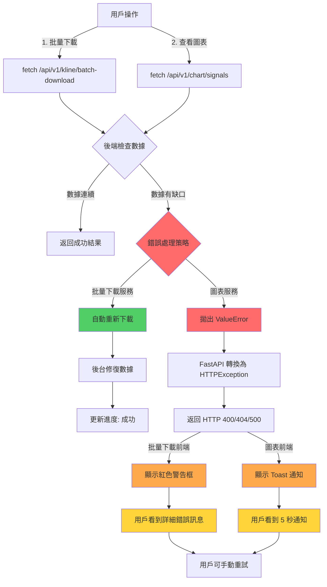

# 前端錯誤處理分析報告

> 回答問題：當零容忍檢查發現問題，前端哪裡會告知使用者有問題？還是會自動解決？

## 📄 執行摘要

**結論**：
- ❌ **不會自動解決** - 零容忍檢查發現問題會直接拋出錯誤，不會嘗試自動修復
- ✅ **會告知使用者** - 前端有完整的錯誤顯示機制，但具體顯示位置取決於操作情境
- ⚠️ **顯示方式不統一** - 不同功能使用不同的錯誤顯示機制

---

## 🔍 完整錯誤處理流程分析

### 階段 1: 後端檢測到數據不連續

#### 觸發點（KlineStorageManager.read_klines）
```python
# momentum/DataExtraction/kline_storage.py (lines 938-1016)

def _validate_continuity(self, df: pd.DataFrame, symbol: str, timeframe: str) -> None:
    """
    零容忍連續性驗證
    
    如果發現缺口，直接拋出 ValueError
    """
    if len(df) < 2:
        return
    
    # 時間排序
    df_sorted = df.sort_values('timestamp')
    timestamps = df_sorted['timestamp'].values
    
    # 計算時間差
    diffs = np.diff(timestamps)
    expected_diff = self.TIMEFRAME_SECONDS[timeframe]
    
    # 零容忍檢查
    gaps = np.where(diffs != expected_diff)[0]
    
    if len(gaps) > 0:
        # 拋出 ValueError（包含詳細缺口資訊）
        raise ValueError(
            f"❌ 數據不連續: {symbol}/{timeframe}\n"
            f"   發現 {len(gaps)} 個缺口\n"
            f"   第一個缺口: timestamp[{gaps[0]}]={timestamps[gaps[0]]} -> "
            f"timestamp[{gaps[0]+1}]={timestamps[gaps[0]+1]}\n"
            f"   時間差: {diffs[gaps[0]]}秒 (預期: {expected_diff}秒)\n"
            f"   缺少 K 線數: {(diffs[gaps[0]] - expected_diff) // expected_diff} 根"
        )
```

#### API 服務層處理

**1. 批量下載服務（batch_download_service.py）**
```python
# api/services/batch_download_service.py (lines 294-325)

try:
    # 讀取數據並驗證連續性
    existing_df = await asyncio.to_thread(
        self.kline_storage.read_klines,
        symbol,
        timeframe,
        validate_continuity=True  # 啟用零容忍檢查
    )
    
    # ✅ 沒有拋出異常 = 數據完整
    logger.warning(f"⏭️ SKIPPING download for {symbol}/{timeframe}")
    
except ValueError as e:
    # ❌ 捕獲 ValueError = 數據有缺口
    logger.warning(
        f"⚠️ Existing data for {symbol}/{timeframe} has GAPS - forcing redownload\n"
        f"   Continuity error: {str(e)}\n"
        f"   🔄 Will redownload to ensure data integrity"
    )
    # 不拋出錯誤，繼續執行下載流程（自動修復）
```

**處理策略**：
- ✅ **自動修復** - 重新下載數據
- 🔄 **不中斷流程** - 繼續處理其他 symbol/案例
- 📋 **記錄日誌** - 將錯誤記錄到日誌系統

---

**2. 圖表訊號服務（chart_signal_service.py）**
```python
# api/services/chart_signal_service.py (lines 330-390)

def _load_klines(self, symbol: str, timeframe: str, start_time: int, end_time: int):
    """讀取 K 線數據（嚴格連續性）"""
    try:
        # 啟用零容忍檢查
        klines = self.kline_storage.read_klines(
            symbol=symbol,
            timeframe=timeframe,
            start_time=start_ts_sec,
            end_time=end_ts_sec,
            validate_continuity=True  # ⚠️ 必須連續，圖表不可缺K
        )
        
        if klines is None or len(klines) == 0:
            raise FileNotFoundError(f"K線數據不存在或為空: {symbol} {timeframe}")
        
        return klines
        
    except ValueError as e:
        # ❌ 連續性檢查失敗 - 向上傳播錯誤
        self.logger.error(f"數據連續性檢查失敗: {e}")
        raise  # 重新拋出，讓路由層處理
        
    except Exception as e:
        self.logger.error(f"讀取K線數據失敗: {e}", exc_info=True)
        raise
```

**處理策略**：
- ❌ **不自動修復** - 直接拋出錯誤
- 🚫 **中斷流程** - 不返回圖表數據
- ⬆️ **向上傳播** - 錯誤傳遞到路由層 → FastAPI → 前端

---

### 階段 2: API 路由層錯誤響應

#### FastAPI 錯誤處理模式
```python
# api/routes/*.py (通用模式)

@router.post("/some-endpoint")
async def endpoint(...):
    try:
        # 呼叫服務層
        result = await service.do_something(...)
        return result
        
    except HTTPException:
        # 已經是 HTTPException - 直接向上傳播
        raise
        
    except ValueError as e:
        # 驗證錯誤（包括連續性檢查失敗）
        logger.error(f"Validation error: {e}")
        raise HTTPException(
            status_code=400,  # Bad Request
            detail=str(e)     # 錯誤訊息包含缺口詳情
        )
        
    except FileNotFoundError as e:
        # 檔案不存在
        logger.error(f"File not found: {e}")
        raise HTTPException(
            status_code=404,  # Not Found
            detail=str(e)
        )
        
    except Exception as e:
        # 未預期的錯誤
        logger.error(f"Unexpected error: {e}", exc_info=True)
        raise HTTPException(
            status_code=500,  # Internal Server Error
            detail="內部伺服器錯誤"
        )
```

#### 錯誤響應格式
```json
// HTTP 400 - 數據連續性錯誤範例
{
  "detail": "❌ 數據不連續: BTCUSDT/12h\n   發現 3 個缺口\n   第一個缺口: timestamp[150]=1640000000 -> timestamp[151]=1640007200\n   時間差: 7200秒 (預期: 43200秒)\n   缺少 K 線數: 5 根"
}

// HTTP 404 - 數據不存在範例
{
  "detail": "K線數據不存在或為空: BTCUSDT 12h"
}

// HTTP 500 - 內部錯誤範例
{
  "detail": "內部伺服器錯誤"
}
```

---

### 階段 3: 前端接收並顯示錯誤

#### 3.1 批量下載功能（BatchDownloadPanel.tsx）

**錯誤接收**：
```typescript
// frontend/src/components/case/BatchDownloadPanel.tsx (lines 93-130)

const handleStartDownload = async () => {
  setError(null);  // 清除舊錯誤
  setDownloading(true);
  
  try {
    const response = await fetch(`${API_BASE_URL}/api/v1/kline/batch-download`, {
      method: "POST",
      headers: { "Content-Type": "application/json" },
      body: JSON.stringify(requestPayload),
    });
    
    // 後端回傳錯誤 (HTTP 4xx/5xx)
    if (!response.ok) {
      const errorData = await response.json();
      throw new Error(errorData.detail || "Download failed");
    }
    
    // 成功 - 啟動輪詢
    const result = await response.json();
    setTaskId(result.task_id);
    fetchProgress(result.task_id);
    
  } catch (err) {
    // 捕獲錯誤並顯示
    setError(err instanceof Error ? err.message : "Download failed");
  } finally {
    setDownloading(false);
  }
};
```

**錯誤顯示**：
```tsx
// BatchDownloadPanel.tsx (lines 270-276)

{/* Error Message - 紅色警告框 */}
{error && (
  <div className="mt-4 p-3 bg-rose-500/10 border border-rose-400/30 rounded">
    <p className="text-sm font-medium text-rose-200">{error}</p>
  </div>
)}
```

**顯示範例**：
```
┌─────────────────────────────────────────────────────┐
│  ❌ 數據不連續: BTCUSDT/12h                          │
│     發現 3 個缺口                                    │
│     第一個缺口: timestamp[150]=1640000000 ...       │
│     時間差: 7200秒 (預期: 43200秒)                  │
│     缺少 K 線數: 5 根                               │
└─────────────────────────────────────────────────────┘
```

**優點**：
- ✅ 顯示完整錯誤訊息（包含技術細節）
- ✅ 固定在操作區域，不會自動消失
- ✅ 紅色視覺警示明顯

**缺點**：
- ⚠️ 技術術語可能讓一般使用者困惑

---

**進度面板錯誤顯示**：
```tsx
// BatchDownloadPanel.tsx (lines 310-340)

{/* Failed Cases - 失敗案例列表 */}
{progress.failed_case_ids.length > 0 && (
  <div className="mt-4 p-3 bg-rose-500/10 border border-rose-400/30 rounded">
    <p className="text-sm font-semibold text-rose-200 mb-2">
      失敗案例 ({progress.failed_case_ids.length}):
    </p>
    <ul className="list-disc list-inside text-sm font-medium text-rose-200/80">
      {progress.failed_case_ids.slice(0, 5).map((caseId, idx) => (
        <li key={idx}>{caseId}</li>
      ))}
      {progress.failed_case_ids.length > 5 && (
        <li className="text-slate-500">
          ...還有 {progress.failed_case_ids.length - 5} 個
        </li>
      )}
    </ul>
    
    {/* 錯誤訊息摘要 */}
    {progress.error_messages.length > 0 && (
      <div className="mt-2">
        <p className="text-sm font-semibold text-rose-200 mb-1">錯誤訊息:</p>
        <ul className="list-disc list-inside text-sm text-rose-200/80">
          {progress.error_messages.slice(0, 3).map((msg, idx) => (
            <li key={idx}>{msg}</li>
          ))}
        </ul>
      </div>
    )}
  </div>
)}
```

**顯示範例**：
```
┌─────────────────────────────────────────────────────┐
│  失敗案例 (12):                                      │
│  • case_001                                          │
│  • case_003                                          │
│  • case_007                                          │
│  • case_012                                          │
│  • case_015                                          │
│  ...還有 7 個                                         │
│                                                      │
│  錯誤訊息:                                            │
│  • 數據不連續: BTCUSDT/12h 發現 3 個缺口             │
│  • 數據不連續: ETHUSDT/1h 發現 1 個缺口              │
│  • API 限流: 429 Too Many Requests                   │
└─────────────────────────────────────────────────────┘
```

---

#### 3.2 圖表展示功能（strategy-test/page.tsx, charts/page.tsx）

**錯誤接收**：
```typescript
// frontend/src/app/strategy-test/page.tsx (lines 575-630)

const handleStartOptimization = async () => {
  try {
    // Step 1: 呼叫 chart/signals 取得圖表數據
    const chartResponse = await fetch(`${API_BASE_URL}/api/v1/chart/signals`, {
      method: "POST",
      headers: { "Content-Type": "application/json" },
      body: JSON.stringify(chartRequest),
    });
    
    // 後端回傳錯誤（數據不連續等）
    if (!chartResponse.ok) {
      const errorData = await chartResponse.json();
      const message = errorData.detail || "Failed to fetch chart signals";
      toast.error(message);  // 🔔 Toast 通知
      return;
    }
    
    const chartData: ChartSignalResponse = await chartResponse.json();
    
    // Step 2: ... 繼續優化流程
    
  } catch (error) {
    const message = error instanceof Error ? error.message : "未知錯誤";
    toast.error(message);  // 🔔 Toast 通知
  }
};
```

**錯誤顯示 - Toast 通知**：
```tsx
// frontend/src/components/providers/ToastProvider.tsx (lines 40-48)

// 錯誤訊息配置
error: {
  duration: 5000,  // 顯示 5 秒
  iconTheme: {
    primary: '#fb7185',  // 粉紅色 (rose-400)
    secondary: '#fff',
  },
  style: {
    background: '#fb7185',
    color: '#fff',
  },
}
```

**顯示範例**：
```
┌─────────────────────────────────────────────────────┐
│ ❌  ❌ 數據不連續: BTCUSDT/12h                       │  ← Toast 通知（右上角）
│     發現 3 個缺口                                    │     粉紅色背景
│     第一個缺口: timestamp[150]=1640000000 ...       │     5 秒後自動消失
└─────────────────────────────────────────────────────┘
```

**優點**：
- ✅ 全域通知，不受頁面位置限制
- ✅ 自動消失（5 秒），不干擾工作流程
- ✅ 視覺明顯（右上角，粉紅色）

**缺點**：
- ⚠️ 5 秒消失可能太快（長錯誤訊息讀不完）
- ⚠️ 無法複製錯誤訊息文字（不利於除錯）

---

#### 3.3 錯誤邊界（ErrorBoundary.tsx）

**用途**：捕獲 React 組件渲染錯誤（不是 API 錯誤）

```tsx
// frontend/src/components/ErrorBoundary.tsx (lines 50-70)

// 當組件內部拋出錯誤時顯示
<div className="glass-panel border border-rose-400/30 rounded-lg p-6">
  <div className="flex items-start">
    <svg className="w-6 h-6 text-rose-400 mr-3">...</svg>
    <div>
      <h3 className="text-sm font-semibold text-rose-100 mb-1">
        組件渲染錯誤
      </h3>
      <p className="text-sm text-rose-200">
        {this.state.error?.message || '發生未知錯誤'}
      </p>
      <button onClick={() => this.setState({ hasError: false, error: null })}>
        重試
      </button>
    </div>
  </div>
</div>
```

**注意**：
- ⚠️ **不會捕獲數據連續性錯誤** - 因為這些是 API 錯誤，不是渲染錯誤
- ✅ **防止整個應用崩潰** - 只影響單個組件

---

## 🎯 各功能的錯誤顯示方式總結

| 功能 | 觸發情境 | 顯示方式 | 位置 | 持續時間 | 可否複製 | 使用者體驗 |
|------|---------|---------|------|---------|---------|-----------|
| **批量下載** | 初始請求失敗 | 紅色警告框 | 下載按鈕下方 | 永久（手動關閉） | ✅ 可 | ⭐⭐⭐⭐⭐ 最佳 |
| **批量下載** | 部分案例失敗 | 進度面板失敗列表 | 進度條下方 | 永久（直到重試） | ✅ 可 | ⭐⭐⭐⭐⭐ 最佳 |
| **圖表展示** | 請求失敗 | Toast 通知 | 右上角 | 5 秒 | ❌ 否 | ⭐⭐⭐ 中等 |
| **優化執行** | 請求失敗 | Toast 通知 | 右上角 | 5 秒 | ❌ 否 | ⭐⭐⭐ 中等 |
| **組件渲染** | JavaScript 錯誤 | 錯誤邊界 | 組件位置 | 永久（手動重試） | ❌ 否 | ⭐⭐⭐⭐ 良好 |

---

## 📊 完整錯誤流程示意圖



---

## 🔄 自動修復 vs 錯誤通知

### 自動修復情境（批量下載）

**前提條件**：
1. 使用批量下載功能
2. 後端檢查發現現有數據有缺口
3. 系統處於批量下載流程中

**處理流程**：
```python
# api/services/batch_download_service.py

try:
    # 檢查現有數據連續性
    existing_df = kline_storage.read_klines(..., validate_continuity=True)
    
    # 數據連續 - 跳過下載
    logger.warning(f"⏭️ SKIPPING download - data is complete")
    continue
    
except ValueError as e:
    # 數據有缺口 - 自動重新下載
    logger.warning(f"⚠️ Data has gaps - forcing redownload: {e}")
    
    # 🔄 執行下載（自動修復）
    new_data = await download_klines(...)
    kline_storage.write_klines(...)
    
    # 更新進度
    progress.completed_cases += 1
    progress.status = "completed"
```

**使用者體驗**：
- ✅ 完全透明 - 使用者看不到錯誤
- ✅ 自動修復 - 無需手動介入
- 📋 日誌記錄 - 管理員可查看修復歷史

---

### 錯誤通知情境（圖表展示）

**前提條件**：
1. 使用圖表展示功能
2. 後端檢查發現數據有缺口
3. 無法自動修復（需要完整連續數據才能繪圖）

**處理流程**：
```python
# api/services/chart_signal_service.py

try:
    # 讀取數據（嚴格連續性要求）
    klines = kline_storage.read_klines(..., validate_continuity=True)
    
    # 計算指標
    with_indicators = calculate_all_indicators(klines, config)
    
    # 返回圖表數據
    return {
        "klines": klines.to_dict('records'),
        "signals": [...],
        ...
    }
    
except ValueError as e:
    # 數據有缺口 - 無法繪圖
    logger.error(f"數據連續性檢查失敗: {e}")
    
    # ❌ 拋出錯誤（不修復）
    raise  # 向上傳播到 FastAPI → 前端
```

**前端顯示**：
```typescript
// Toast 通知
toast.error("❌ 數據不連續: BTCUSDT/12h\n發現 3 個缺口...");
```

**使用者體驗**：
- ⚠️ 顯示錯誤 - 使用者需要知道問題
- ❌ 不自動修復 - 需要手動處理
- 🔧 建議動作 - 使用批量下載重新下載數據

---

## 💡 改進建議

### 1. 統一錯誤顯示機制（優先級：🔴 P1）

**問題**：
- 批量下載使用「紅色警告框」（永久顯示）
- 圖表/優化使用「Toast 通知」（5 秒消失）
- 不同功能的錯誤體驗不一致

**建議**：
```typescript
// 統一錯誤處理策略

enum ErrorSeverity {
  INFO = "info",        // 藍色，5秒
  WARNING = "warning",  // 黃色，10秒
  ERROR = "error",      // 紅色，15秒
  CRITICAL = "critical" // 永久顯示（需手動關閉）
}

function handleApiError(error: ApiError, context: string) {
  // 根據錯誤類型決定顯示方式
  if (error.status === 400 && error.detail.includes("數據不連續")) {
    // 數據連續性錯誤 - 關鍵錯誤
    showPersistentError({
      title: "數據品質問題",
      message: error.detail,
      severity: ErrorSeverity.CRITICAL,
      actions: [
        { label: "重新下載數據", onClick: () => startRedownload() },
        { label: "查看詳情", onClick: () => openErrorDetails() }
      ]
    });
  } else {
    // 一般錯誤 - Toast 通知
    toast.error(error.detail, { duration: 10000 });
  }
}
```

---

### 2. 錯誤訊息使用者友善化（優先級：🟡 P2）

**問題**：
- 技術術語過多：「timestamp[150]=1640000000」
- 一般使用者看不懂「時間差: 7200秒 (預期: 43200秒)」

**建議**：
```python
# 雙層錯誤訊息系統

def format_error_for_users(error: ValidationError) -> Dict[str, str]:
    """將技術錯誤轉換為使用者友善訊息"""
    
    if isinstance(error, ContinuityError):
        return {
            # 使用者訊息（簡潔易懂）
            "user_message": (
                f"⚠️ {error.symbol}/{error.timeframe} 的歷史數據不完整\n"
                f"   缺少 {error.missing_bars} 根 K 線\n"
                f"   建議：重新下載此幣種的數據"
            ),
            
            # 技術細節（可展開查看）
            "technical_details": (
                f"數據不連續: {error.symbol}/{error.timeframe}\n"
                f"發現 {len(error.gaps)} 個缺口\n"
                f"第一個缺口: timestamp[{error.gaps[0].index}]="
                f"{error.gaps[0].timestamp} -> "
                f"timestamp[{error.gaps[0].index+1}]={error.gaps[0].next_timestamp}\n"
                f"時間差: {error.gaps[0].diff}秒 (預期: {error.expected_diff}秒)\n"
                f"缺少 K 線數: {error.gaps[0].missing_bars} 根"
            )
        }
```

**前端顯示**：
```tsx
<div className="error-panel">
  <p className="user-message">{error.user_message}</p>
  
  <details className="technical-details">
    <summary>技術細節</summary>
    <pre>{error.technical_details}</pre>
  </details>
  
  <div className="actions">
    <button onClick={handleRedownload}>重新下載</button>
    <button onClick={handleCopyError}>複製錯誤訊息</button>
  </div>
</div>
```

---

### 3. 錯誤恢復指引（優先級：🟡 P2）

**問題**：
- 使用者看到錯誤後不知道如何處理
- 需要手動查找「批量下載」功能

**建議**：
```typescript
// 錯誤 + 動作引導

interface ErrorWithActions {
  message: string;
  severity: ErrorSeverity;
  actions: {
    primary?: ErrorAction;    // 主要動作（推薦）
    secondary?: ErrorAction[];  // 次要動作
  };
}

interface ErrorAction {
  label: string;
  icon?: string;
  onClick: () => void;
  isDestructive?: boolean;
}

// 使用範例
showError({
  message: "BTCUSDT/12h 的數據不完整，無法顯示圖表",
  severity: ErrorSeverity.ERROR,
  actions: {
    primary: {
      label: "立即下載完整數據",
      icon: "download",
      onClick: () => {
        // 跳轉到批量下載頁面並預填參數
        router.push(`/batch-download?symbol=BTCUSDT&timeframe=12h&force=true`);
      }
    },
    secondary: [
      {
        label: "使用其他幣種",
        onClick: () => openSymbolSelector()
      },
      {
        label: "查看幫助文件",
        onClick: () => window.open('/docs/data-integrity')
      }
    ]
  }
});
```

---

### 4. Toast 通知持續時間動態調整（優先級：🟢 P3）

**問題**：
- 短錯誤訊息 5 秒足夠
- 長錯誤訊息（如數據連續性詳情）5 秒讀不完

**建議**：
```typescript
// 根據訊息長度動態調整持續時間

function showToast(message: string, type: 'success' | 'error' | 'info') {
  const baseTime = 3000;  // 基礎 3 秒
  const charTime = 50;    // 每字 50 毫秒
  
  // 計算持續時間（最少 3 秒，最多 15 秒）
  const duration = Math.min(
    Math.max(baseTime, message.length * charTime),
    15000
  );
  
  toast[type](message, { duration });
}

// 或提供「固定」選項
function showPersistentToast(message: string) {
  toast(message, {
    duration: Infinity,  // 永不自動消失
    dismissButton: true  // 顯示關閉按鈕
  });
}
```

---

### 5. 錯誤追蹤與日誌（優先級：🟢 P3）

**問題**：
- Toast 消失後無法回顧錯誤歷史
- 除錯時無法提供完整錯誤訊息

**建議**：
```typescript
// 錯誤歷史記錄

interface ErrorLog {
  id: string;
  timestamp: Date;
  context: string;  // "batch-download", "chart-display"
  message: string;
  technicalDetails: string;
  userAction?: string;  // "dismissed", "retried", "ignored"
}

class ErrorLogger {
  private logs: ErrorLog[] = [];
  
  log(error: ApiError, context: string) {
    this.logs.push({
      id: uuid(),
      timestamp: new Date(),
      context,
      message: error.user_message,
      technicalDetails: error.technical_details
    });
    
    // 持久化到 localStorage
    localStorage.setItem('error-logs', JSON.stringify(this.logs));
  }
  
  getLogs(context?: string): ErrorLog[] {
    return context 
      ? this.logs.filter(log => log.context === context)
      : this.logs;
  }
}

// UI: 錯誤歷史面板
<ErrorHistoryPanel>
  {errorLogger.getLogs().map(log => (
    <ErrorLogItem key={log.id}>
      <time>{log.timestamp}</time>
      <span>{log.context}</span>
      <p>{log.message}</p>
      <button onClick={() => copyToClipboard(log.technicalDetails)}>
        複製詳情
      </button>
    </ErrorLogItem>
  ))}
</ErrorHistoryPanel>
```

---

## ✅ 最終回答

### 問題 1: 當零容忍檢查發現問題，前端哪裡會告知使用者？

**答案**：取決於操作情境

| 情境 | 顯示位置 | 顯示方式 | 範例 |
|------|---------|---------|------|
| **批量下載** | 下載按鈕下方 | 紅色警告框（永久） | "❌ 數據不連續: BTCUSDT/12h 發現 3 個缺口..." |
| **批量下載進度** | 進度條下方 | 失敗案例列表 | "失敗案例 (12): case_001, case_003..." |
| **圖表展示** | 右上角 | Toast 通知（5秒） | "❌ 數據不連續: BTCUSDT/12h..." |
| **優化執行** | 右上角 | Toast 通知（5秒） | "無法啟動優化：數據不完整" |

---

### 問題 2: 還是會自動解決？

**答案**：部分情況會自動解決

| 情境 | 是否自動解決 | 處理方式 |
|------|------------|---------|
| **批量下載** | ✅ **會** | 自動重新下載缺失數據，使用者無感知 |
| **圖表展示** | ❌ **不會** | 拋出錯誤並顯示 Toast，需手動處理 |
| **優化執行** | ❌ **不會** | 拋出錯誤並顯示 Toast，需手動處理 |
| **案例讀取** | ❌ **不會** | 拋出錯誤，需先修復數據 |

---

### 處理邏輯總結

```python
# 零容忍檢查處理邏輯

if 處於批量下載流程:
    if 數據有缺口:
        自動重新下載()  # ✅ 自動修復
        更新進度為成功()
        記錄日誌()
    else:
        跳過下載()
        使用現有數據()

elif 處於圖表/優化流程:
    if 數據有缺口:
        拋出 ValueError()  # ❌ 不修復
        傳播到前端()
        顯示錯誤訊息()
        建議手動處理()
```

---

## 🎯 關鍵設計原則

1. **批量下載 = 自動修復** - 因為下載是預期的修復機制
2. **即時操作 = 顯示錯誤** - 因為無法立即修復，需要使用者決策
3. **錯誤訊息完整** - 包含技術細節，方便除錯
4. **不同情境不同處理** - 根據使用者預期和操作流程決定
